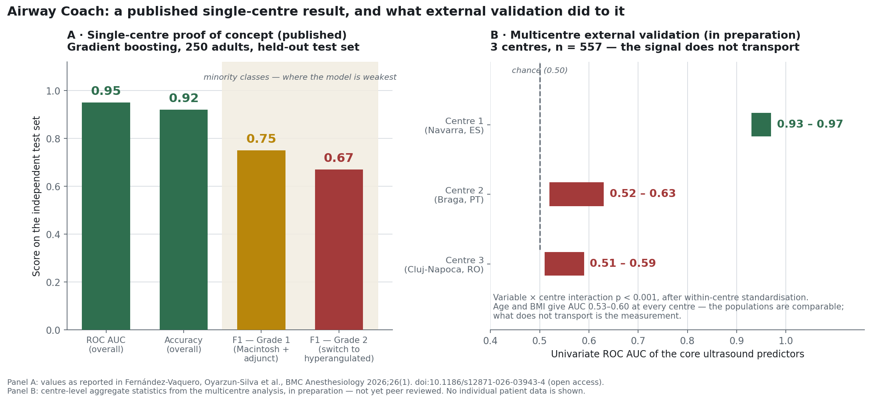

# Airway Coach — ML support for videolaryngoscopy strategy

A peer-reviewed clinical machine learning study, and the external validation that
followed it. The published model reaches **AUC 0.95 / 92% accuracy** on a held-out
test set at a single centre. A subsequent three-centre analysis found that its core
ultrasound signal **does not transport** to the other two centres. Both halves are in
this README, in that order, because the second half is the part that says something
about how the work was done.



## The published study

> Fernández-Vaquero MA, **Oyarzun-Silva R**, Hernández-Hernández P, Gómez-Ríos MÁ,
> Petrisor C, Falcetta S, Gomes SH, De Luis-Cabezón N.
> *Airway coach project: development of a machine learning-based model using clinical
> and ultrasound parameters to support videolaryngoscopy strategy.*
> **BMC Anesthesiology** 2026;26(1). Published 18 June 2026.
> [doi:10.1186/s12871-026-03943-4](https://doi.org/10.1186/s12871-026-03943-4)
> · PMID [42316024](https://pubmed.ncbi.nlm.nih.gov/42316024/)
> · PMC [PMC13425934](https://www.ncbi.nlm.nih.gov/pmc/articles/PMC13425934/) (open access)
> · Registered as [NCT06925009](https://clinicaltrials.gov/study/NCT06925009)

My role: **second author** in an eight-author consortium spanning Spain, Romania,
Italy and Portugal. The study is the work of that group; the anaesthesiology
leadership and the clinical protocol are Miguel Ángel Fernández-Vaquero's, and the
contribution described below is the modelling and evaluation side of it.

### The clinical problem

Videolaryngoscopy (VL) is now recommended as a first-line technique for tracheal
intubation, but the airway assessment tools in routine use were derived for *direct*
laryngoscopy. They predict whether intubation will be hard in general; they say very
little about the decisions a clinician actually faces with a videolaryngoscope in
hand — which blade to pick, whether to have adjuncts ready before starting.
Bedside airway ultrasound (POCUS) adds anatomical information those legacy scores
never used.

### Design

Prospective, observational, **single-centre**. **250 adults** (ASA I–III) undergoing
elective surgery, assessed preoperatively with clinical variables plus airway POCUS.
Every intubation was started with a Macintosh-type blade and then graded
prospectively on what the procedure actually required:

| Grade | What the intubation needed |
|---|---|
| **0** | Macintosh blade, no adjuncts |
| **1** | Macintosh blade, adjuncts required |
| **2** | Switch to a hyperangulated device |

This is a deliberately *decision-shaped* label. It is not "difficult airway: yes/no";
each class maps onto a different thing to do, which is what makes a prediction
actionable at the bedside — and also what makes the problem a three-class one with
two under-represented classes.

### Modelling and results

Supervised multi-class classification over the combined clinical + ultrasound
feature set, stratified cross-validation on the training partition, and a single
read on an **independent test set**. The selected model was **gradient boosting**.

| Metric | Value |
|---|---|
| ROC AUC (independent test set) | **0.95** |
| Accuracy | **92%** |
| F1 — Grade 1 (Macintosh + adjunct) | **0.75** |
| F1 — Grade 2 (switch to hyperangulated) | **0.67** |

The headline numbers and the per-class numbers disagree, and the paper reports both.
Aggregate accuracy is carried by the majority class; the two grades that would
actually change what a clinician prepares are the two the model is worst at. An
F1 of 0.67 on "you will need to switch devices" is not a number to deploy on.

Classification was driven by tongue-related ultrasound parameters, anterior cervical
soft-tissue distances, BMI and age. The authors' own conclusion is that the study
demonstrates **feasibility** and requires further evaluation in independent
populations before any clinical implementation.

## What external validation did to it

The obvious next step for a single-centre model with an AUC of 0.95 is to check
whether it survives contact with other centres. A follow-up multicentre analysis
(**n = 557**, three centres: Navarra, Braga, Cluj-Napoca) did that.

It does not survive. The univariate AUC of the core ultrasound predictors:

| Centre | Univariate AUC of the core ultrasound predictors |
|---|---|
| Navarra (original centre) | **0.93 – 0.97** |
| Braga | **0.52 – 0.63** |
| Cluj-Napoca | **0.51 – 0.59** |

Outside the originating centre, the predictors are at or barely above chance. The
variable × centre interaction is **p < 0.001** and survives standardising each
variable within its own centre, so this is not a scaling artefact.

The interesting part is the diagnosis. The natural excuse — "different populations"
— does not hold: age and BMI give AUC 0.53–0.60 at *every* centre, i.e. the case mix
is comparable across sites. What differs is the measurement. The evidence points to
a lack of harmonisation in how the ultrasound parameters are acquired: probe
placement, landmark definition, and operator convention were standardised inside one
centre and not across centres. The predictive signal in the published model is
partly a property of one imaging protocol rather than of anatomy.

That is a **measurement-transportability** failure, not a modelling failure, and no
amount of regularisation, resampling or architecture search fixes it. The fix is
upstream: a shared acquisition protocol and inter-rater agreement on the ultrasound
measurements, before any model is refit.

> **Status note.** The multicentre analysis is **in preparation / preprint stage and
> has not been peer reviewed or published.** The only published output of this line
> of work is the BMC Anesthesiology paper cited above. The cross-centre numbers are
> reported here as work in progress and should be read as such.

## Why this is in the portfolio

Not because of the 0.95. Because of the sequence:

1. **Publish the finding** in a peer-reviewed journal, with per-class metrics that
   show where the model is weak rather than only the aggregate that flatters it.
2. **Subject it to external validation** on centres that had no part in developing it.
3. **Report that it did not generalise**, and identify the mechanism.

Step 3 is the one most commonly skipped. A single-centre AUC of 0.95 in clinical ML
is a hypothesis, not a product, and the honest way to find out which one you have is
to run the test that can falsify it. The value of this project is a complete
scientific cycle with a negative external result reported rather than buried — and a
concrete, actionable cause (protocol harmonisation) rather than a shrug.

## Scope and restrictions

- **No patient data.** This folder contains no dataset, no individual-level records,
  and no derived per-patient values. Every number here is either published in the
  open-access paper or a centre-level aggregate statistic.
- **No implementation details.** A **patent application is pending** on methods
  related to this work (Oyarzún-Silva and Fernández-Vaquero among the inventors).
  This README is deliberately limited to what is already public in the paper: no
  code, no feature engineering specifics, no model formulation.
- **Attribution.** The published work is cited in full above with its DOI. The figure
  in `assets/` is generated from the reported summary statistics; no figure or table
  is reproduced from the paper.

## Contents

```
airway_coach_videolaryngoscopy/
├── README.md
└── assets/
    └── poc_vs_external_validation.png   # published performance vs. cross-centre AUC
```
