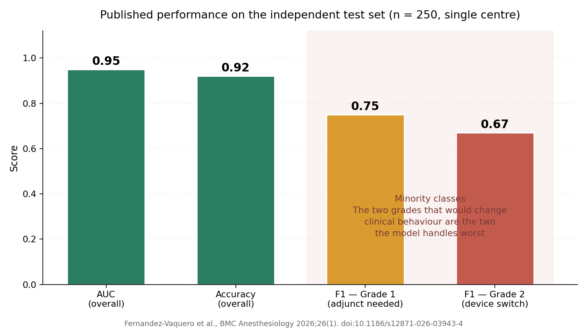

# Airway Coach — ML support for videolaryngoscopy strategy

A peer-reviewed clinical machine learning study: a multimodal model combining clinical
variables and point-of-care airway ultrasound to anticipate which videolaryngoscopy
strategy a patient will require. Published in **BMC Anesthesiology**, reaching
**AUC 0.95 / 92% accuracy** on an independent test set — with the per-class results
that qualify that number reported alongside it.



## The published study

> Fernández-Vaquero MA, **Oyarzun-Silva R**, Hernández-Hernández P, Gómez-Ríos MÁ,
> Petrisor C, Falcetta S, Gomes SH, De Luis-Cabezón N.
> *Airway coach project: development of a machine learning-based model using clinical
> and ultrasound parameters to support videolaryngoscopy strategy.*
> **BMC Anesthesiology** 2026;26(1). Published 18 June 2026.
> [doi:10.1186/s12871-026-03943-4](https://doi.org/10.1186/s12871-026-03943-4)
> · PMID [42316024](https://pubmed.ncbi.nlm.nih.gov/42316024/)
> · PMC [PMC13425934](https://www.ncbi.nlm.nih.gov/pmc/articles/PMC13425934/) (open access)
> · Registered as [NCT06925009](https://clinicaltrials.gov/study/NCT06925009)

My role: **second author** in an eight-author consortium spanning Spain, Romania,
Italy and Portugal. The study is the work of that group; the anaesthesiology
leadership and the clinical protocol are Miguel Ángel Fernández-Vaquero's, and the
contribution described below is the modelling and evaluation side of it.

### The clinical problem

Videolaryngoscopy (VL) is now recommended as a first-line technique for tracheal
intubation, but the airway assessment tools in routine use were derived for *direct*
laryngoscopy. They predict whether intubation will be hard in general; they say very
little about the decisions a clinician actually faces with a videolaryngoscope in
hand — which blade to pick, whether to have adjuncts ready before starting.
Bedside airway ultrasound (POCUS) adds anatomical information those legacy scores
never used.

### Design

Prospective, observational, **single-centre**. **250 adults** (ASA I–III) undergoing
elective surgery, assessed preoperatively with clinical variables plus airway POCUS.
Every intubation was started with a Macintosh-type blade and then graded
prospectively on what the procedure actually required:

| Grade | What the intubation needed |
|---|---|
| **0** | Macintosh blade, no adjuncts |
| **1** | Macintosh blade, adjuncts required |
| **2** | Switch to a hyperangulated device |

This is a deliberately *decision-shaped* label. It is not "difficult airway: yes/no";
each class maps onto a different thing to do, which is what makes a prediction
actionable at the bedside — and also what makes the problem a three-class one with
two under-represented classes.

### Modelling and results

Supervised multi-class classification over the combined clinical + ultrasound
feature set, stratified cross-validation on the training partition, and a single
read on an **independent test set**. The selected model was **gradient boosting**.

| Metric | Value |
|---|---|
| ROC AUC (independent test set) | **0.95** |
| Accuracy | **92%** |
| F1 — Grade 1 (Macintosh + adjunct) | **0.75** |
| F1 — Grade 2 (switch to hyperangulated) | **0.67** |

The headline numbers and the per-class numbers disagree, and the paper reports both.
Aggregate accuracy is carried by the majority class; the two grades that would
actually change what a clinician prepares are the two the model is worst at. An
F1 of 0.67 on "you will need to switch devices" is not a number to deploy on.

Classification was driven by tongue-related ultrasound parameters, anterior cervical
soft-tissue distances, BMI and age. The authors' own conclusion is that the study
demonstrates **feasibility** and requires further evaluation in independent
populations before any clinical implementation.

## Why this is in the portfolio

Not because of the 0.95. Three things about how the study was built matter more than
the headline number.

**The outcome was defined around a decision, not around a proxy.** Airway assessment
scores are traditionally validated against the glottic view — what the operator can
see. That is not what a clinician actually needs to know before starting. The
Grade 0/1/2 label used here is defined by *what the procedure required*: whether an
adjunct was needed, whether the device had to be changed. A model predicting that is
answering the question the anaesthetist is actually asking.

**The per-class metrics are reported, not just the aggregate.** An AUC of 0.95 and 92%
accuracy look conclusive. The F1 scores of 0.75 and 0.67 on the minority classes say
something more useful, and less flattering: the two grades that would change clinical
behaviour are the two the model handles worst. Reporting both is the difference
between a result and a claim.

**The limits are stated by the authors themselves.** The paper's own conclusion is
that this demonstrates feasibility and requires evaluation in independent populations
before any clinical implementation. A single-centre AUC of 0.95 in clinical ML is a
hypothesis, not a product, and the paper says so.

## Scope and restrictions

- **No patient data.** This folder contains no dataset, no individual-level records,
  and no derived per-patient values. Every number here is either published in the
  open-access paper or a centre-level aggregate statistic.
- **No implementation details.** A **patent application is pending** on methods
  related to this work (Oyarzún-Silva and Fernández-Vaquero among the inventors).
  This README is deliberately limited to what is already public in the paper: no
  code, no feature engineering specifics, no model formulation.
- **Attribution.** The published work is cited in full above with its DOI. The figure
  in `assets/` is generated from the reported summary statistics; no figure or table
  is reproduced from the paper.

## Contents

```
airway_coach_videolaryngoscopy/
├── README.md
└── assets/
    └── published_performance.png        # aggregate metrics and per-class F1 scores
```
