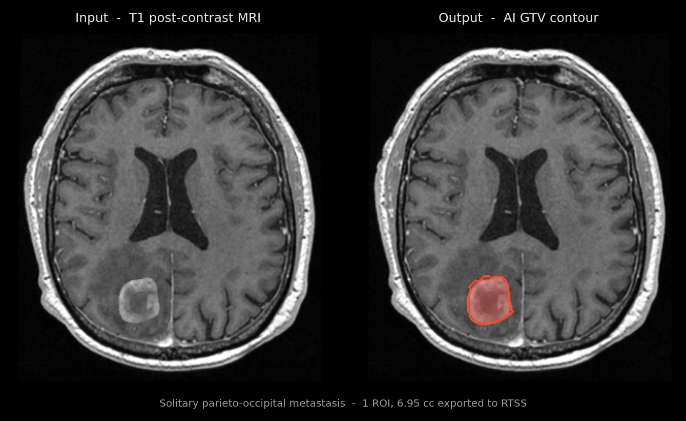
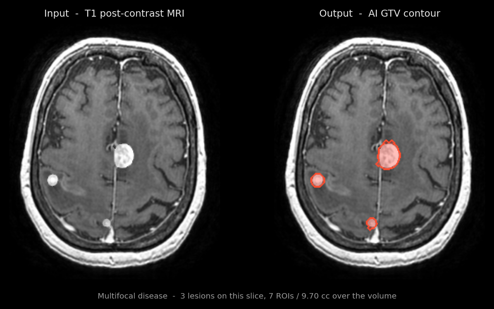
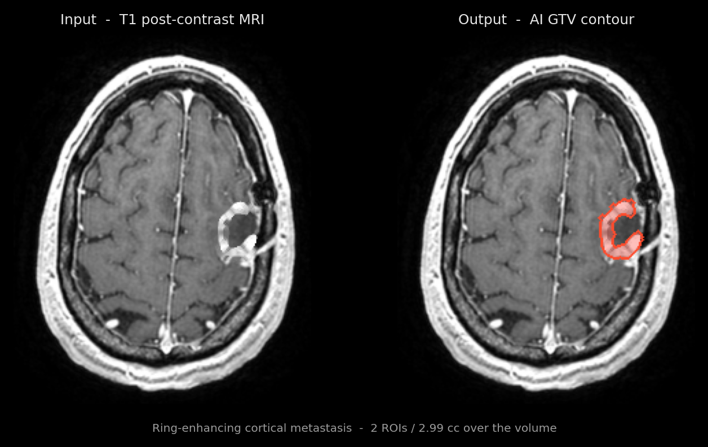
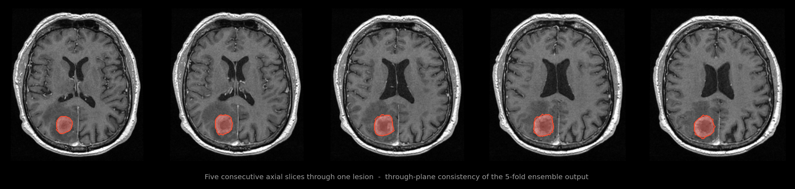
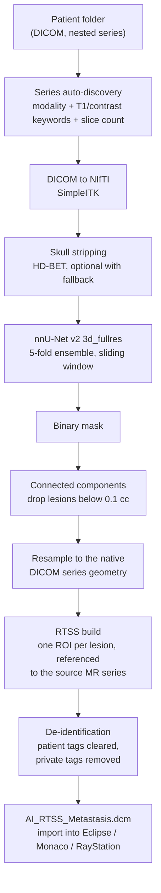

# NeuroContour — Brain Metastasis Auto-Contouring for Radiotherapy Planning

**A packaged desktop application that segments contrast-enhancing brain metastases on post-contrast T1 MRI and exports the result as a DICOM RT Structure Set that imports directly into a treatment planning system (Eclipse, Monaco, RayStation).**

Not a notebook. The deliverable is a model that reaches the clinical workflow.

---

## Segmentation results









All panels are axial post-contrast T1 slices at the level of the lateral ventricles / centrum semiovale, taken from a real batch run of the packaged application. Slices containing the orbits or facial soft tissue were deliberately excluded, since facial anatomy in neuroimaging is a re-identification vector even when the DICOM header is de-identified. See [`docs/imaging-provenance.md`](docs/imaging-provenance.md) for exactly how these figures were produced.

---

## Why this exists

Stereotactic radiosurgery for brain metastases requires a gross tumour volume (GTV) contour for every enhancing lesion. Drawing them by hand is slow, and it scales badly with lesion count — a patient with seven metastases is seven contouring tasks, each of which the radiation oncologist must review.

Automating the *segmentation* is the part everyone does. The part that decides whether a model is used or ignored is what comes out of it: a planner does not accept a NIfTI mask. It accepts a DICOM RT Structure Set referenced to the MR series it was drawn on, so that the TPS can fuse it onto the planning CT and put the contours in front of the physician inside the tool they already work in.

This application closes that gap end to end: point it at a folder of patient DICOM, get back an anonymised RTSS per patient, import it into the TPS.

---

## Architecture and deployment



### Design decisions that matter in deployment

| Decision | Why |
| --- | --- |
| **Series auto-discovery** instead of a fixed path | Clinical export folders are nested and inconsistently named. The app scans recursively, scores candidate series by modality, T1/gadolinium keywords in the series description, and slice count, and picks the best one. The operator pastes a folder path; nothing else. |
| **Single-patient and batch modes auto-detected** | Structure is inferred from whether sub-folders carry distinct `PatientID`s, so the same entry point handles one study or a whole cohort. |
| **Ensemble of 5 folds, `checkpoint_best`** | Standard nnU-Net practice; costs ~5x forward passes but the whole volume still runs in well under a second on GPU (below), so there is no reason to trade it away. |
| **Test-time mirroring disabled** | 8x TTA would multiply inference cost for a marginal gain on a task where the bottleneck is physician review, not the network. |
| **Connected-component filter at 0.1 cc** | Sub-0.1 cc components are overwhelmingly false positives and are not treatable targets. Filtering them at the mask stage keeps the structure set clean — an RTSS full of spurious 3-voxel ROIs gets the tool switched off. |
| **One ROI per lesion, not one merged structure** | Each metastasis gets its own named, colour-coded ROI, because SRS planning treats them as separate targets. |
| **Resample to the native DICOM grid before contouring** | The RTSS is built against the exact geometry of the source series, so contours land correctly after MR–CT fusion in the TPS. |
| **De-identification on the way out** | Patient identifiers, institution, physician and study tags are cleared, private tags stripped, and `PatientIdentityRemoved` set. Verified on all exported files: `PatientName = ANONYMOUS`, `PatientID = ANON_0xx`. |
| **Custom trainer with early stopping** | An nnU-Net trainer variant that halts on a patience window over the EMA foreground pseudo-Dice rather than running the full 1000-epoch schedule. Folds 2–4 were trained with it. |

### Packaging

Two distribution forms, both Windows-first because that is what sits next to a treatment planning system:

- **Installable app** — a one-click dependency installer plus a launcher that opens a local Streamlit UI. The custom trainer variant is installed into the `nnunetv2` package at startup if missing, so folds trained with it load without manual setup.
- **Standalone executable** — a PyInstaller one-directory build: a 77 MB launcher plus a bundled `_internal` runtime (Python 3.11, PyTorch, nnU-Net, SimpleITK, pydicom). No Python installation required on the target machine. The model checkpoints ship alongside it; the checkpoint files are byte-identical across the source tree and the packaged build.

### Model

| | |
| --- | --- |
| Framework | nnU-Net v2, `3d_fullres` |
| Network | `PlainConvUNet`, 6 stages, features 32/64/128/256/320/320, `InstanceNorm3d`, LeakyReLU |
| Patch size | 80 × 192 × 160 |
| Target spacing | 1.5 × 0.8594 × 0.8594 mm |
| Normalisation | Z-score, masked |
| Loss | Dice + cross-entropy with deep supervision |
| Optimiser | SGD, Nesterov, lr 0.01, momentum 0.99, poly schedule |
| Input channel | Single — post-contrast T1 |
| Labels | background / metastasis (binary) |
| Ensemble | 5 folds, `checkpoint_best.pth` each, 246 MB per fold |

---

## Metrics

### Segmentation quality

| Fold | EMA foreground pseudo-Dice | Best epoch | Trainer |
| --- | --- | --- | --- |
| 0 | **0.8389** | 87 | `nnUNetTrainer` |
| 1 | 0.8401 | 13 | `nnUNetTrainer` |
| 2 | 0.8642 | 32 | `nnUNetTrainerEarlyStopping` |
| 3 | 0.8639 | 108 | `nnUNetTrainerEarlyStopping` |
| 4 | 0.8395 | 26 | `nnUNetTrainerEarlyStopping` |
| | mean 0.8493 | | |

**Read this for what it is.** These values are nnU-Net's internal `_best_ema` — an exponential moving average of the foreground pseudo-Dice measured on each fold's held-out training split during training — read directly out of the `checkpoint_best.pth` files. It is a training-time monitoring metric on internal cross-validation data, **not** an independent evaluation against expert contours, and not a clinical validation. Folds 1 and 4 reached their best checkpoint after very few epochs, which is worth knowing before treating the fold-to-fold spread as meaningful.

**Independent validation against expert contours has not been performed.** No such measurement exists in this project, and no accuracy figure against reference contours is claimed here.

### Batch run on 12 studies

The packaged application was run end to end over 12 studies. What the output artefacts actually record is lesion detection and volume, so that is what is reported:

| | |
| --- | --- |
| Studies processed | 12 |
| Studies with at least one exported lesion | 10 |
| Studies with no component above the 0.1 cc threshold | 2 |
| Total ROIs exported | 20 |
| Total contoured volume | 54.10 cc |
| Per-study lesion count | 1–7 |
| Per-study contoured volume | 0.80 – 16.77 cc |
| Errors | 0 |

Every exported file was verified to be a valid `RT Structure Set Storage` object, de-identified, with `ROIGenerationAlgorithm = AUTOMATIC` and a populated frame-of-reference reference back to the source MR series. This run measures that the pipeline produces importable structure sets over a cohort — it does **not** measure contour accuracy, because no reference contours were compared.

### GPU inference latency — measured

Benchmarked with the exact predictor configuration the shipped app builds (`tile_step_size=0.5`, mirroring disabled, everything on device), over a volume at the plans' median size (91 × 202 × 160), so the sliding-window tile count matches a real case: 4 tiles per fold, 20 forward passes for the ensemble.

| | |
| --- | --- |
| GPU | NVIDIA RTX 6000 Ada Generation |
| Runtime | PyTorch 2.11.0 + CUDA 12.8 |
| Model load, 5 folds, cold from disk | 18.5 s (one-time, at app start) |
| First inference after load (CUDA/cuDNN autotune) | 8.3 s |
| **Steady-state full-volume inference** | **0.84 s** (median of 5; sd 0.01 s; range 0.83–0.85 s) |
| Single-fold forward pass, one 80 × 192 × 160 patch | 23.6 ms |
| Peak GPU memory | 2.07 GB |

The 0.84 s figure covers preprocessing, the 5-fold sliding-window ensemble, argmax and resampling back to the native grid. It **excludes** DICOM→NIfTI conversion, HD-BET skull stripping and RTSS export, which are CPU- and I/O-bound and dominate end-to-end wall clock. End-to-end per-patient time was not instrumented and is therefore not quoted.

Training was done on a different card (RTX 3080); the latency numbers above are from the benchmark GPU, not the training GPU.

---

## Training data

| | |
| --- | --- |
| Dataset | UCSF Brain Metastases, release 1.3 |
| Cases | 461 |
| Modality | Post-contrast T1 (single channel) |
| Reference recorded in `dataset.json` | https://pubs.rsna.org/doi/abs/10.1148/ryai.230126 (*Radiology: Artificial Intelligence*) |
| Licence field recorded in `dataset.json` | `"Non-commercial use only"` |

Single-source, single-institution public dataset. No multi-centre or multi-vendor training data.

---

## Model weights

The trained weights are publishable — the model was trained on a public dataset and releasing it is a legitimate contribution. They are **not** in this repository: five folds at 246 MB each is roughly 1.2 GB, past GitHub's 100 MB per-file limit.

Planned distribution, in order of preference:

1. **Hugging Face Hub** — the standard home for model weights, discoverable, and loadable straight into an nnU-Net predictor by pointing `initialize_from_trained_model_folder` at the downloaded model directory. `[weights: to be published — Hugging Face]`
2. **GitHub Releases** — up to 2 GB per asset if keeping everything in one place is preferred.
3. **Zenodo** — if a citable DOI is wanted.

To use them, place the downloaded `nnUNetTrainer__nnUNetPlans__3d_fullres/` directory (containing `fold_0` … `fold_4`, `plans.json` and `dataset.json`) where an nnU-Net v2 predictor can be initialised from it, and select `checkpoint_best.pth`. Folds 2–4 additionally require the custom early-stopping trainer class to be importable under `nnunetv2.training.nnUNetTrainer.variants.training_length`; it is shipped with the weights.

**Open item before publishing the weights.** The `dataset.json` shipped with the model records the training dataset licence as *"Non-commercial use only"*. Whether that permits redistribution of derived model weights, and under what terms, has **not** been confirmed against the actual UCSF data use agreement. That check has to happen before the weights go up — it is not assumed here.

---

## Source code

The application source — the pipeline, the RTSS conversion and de-identification layer, the UI and the packaging — is not included in this repository. It has commercial potential and is kept closed for now; it can be made available under NDA for evaluation. The model, its architecture and the design of the pipeline are documented above in full.

---

## Limitations

Stated plainly, because a reviewer will find these anyway:

- **No independent clinical validation.** The model has never been evaluated against expert contours on a held-out cohort. The only quality figure available is nnU-Net's internal cross-validation pseudo-Dice. Cross-validation over 5 folds of one dataset is internal validation, not external.
- **GTV only.** The model segments the visible enhancing tumour. It does not generate CTV or PTV margins. Everything downstream of the GTV remains a planning decision.
- **Single-source training data.** 461 cases from one public dataset, one institution. Generalisation across scanners, field strengths, vendors and acquisition protocols is untested. Segmentation models are well known to lose accuracy across sites.
- **Sequence-specific.** Requires post-contrast T1. It will not work on T2, FLAIR or non-contrast sequences.
- **Small-lesion floor.** Components below 0.1 cc are discarded by design. Sub-threshold metastases will not appear in the structure set.
- **Contours require review.** Every output is a draft for a radiation oncologist or radiologist to inspect and edit. It is not a substitute for clinical judgement.
- **Not a medical device.** No regulatory clearance, no CE marking, no FDA clearance.

---

## Intended use

**Research use only.** This model and application have not been validated for clinical use and are not a medical device. They are not cleared or approved by any regulatory authority. Nothing produced by this software should be used to make a treatment decision without independent review by a qualified clinician.

---

## Stack

`nnU-Net v2` · `PyTorch` · `CUDA` · `3D U-Net` · `medical image segmentation` · `MRI` · `DICOM` · `DICOM RT Structure Set (RTSS)` · `pydicom` · `rt-utils` · `SimpleITK` · `NIfTI` · `HD-BET` · `scipy` · `NumPy` · `Streamlit` · `PyInstaller` · `radiotherapy treatment planning` · `radiation oncology` · `neuro-oncology` · `de-identification`

## Contents

```
brain_mets_autocontouring/
  README.md
  assets/                     segmentation overlays (privacy-reviewed)
  docs/
    architecture.md           pipeline stages and design rationale
    imaging-provenance.md     how the figures were produced and privacy-checked
```
