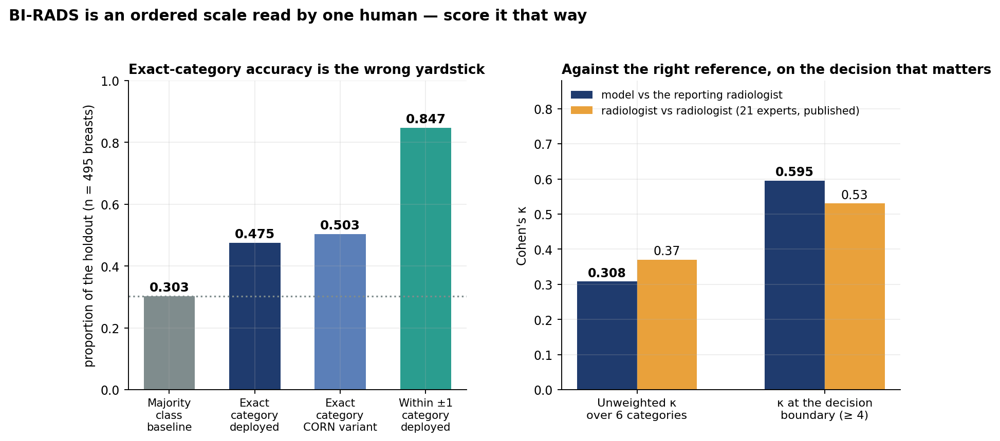
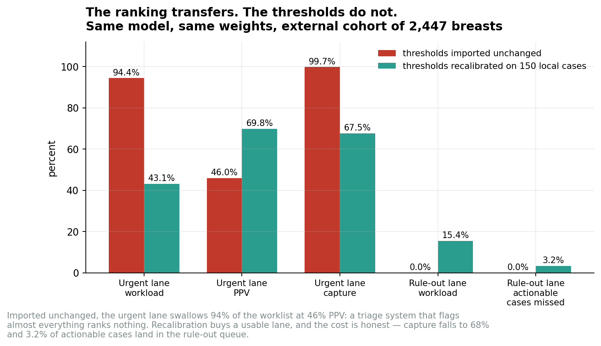
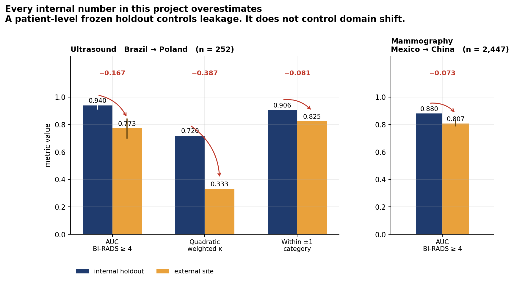
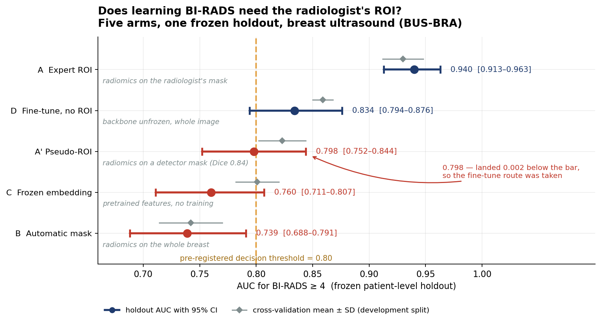
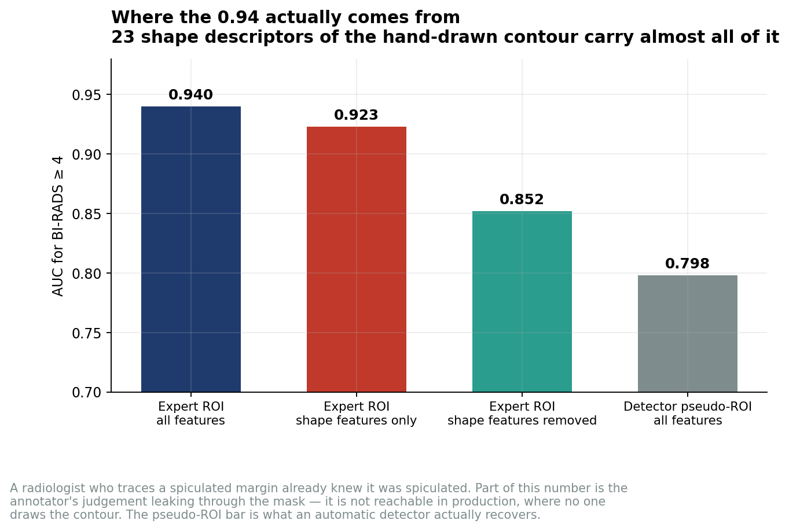
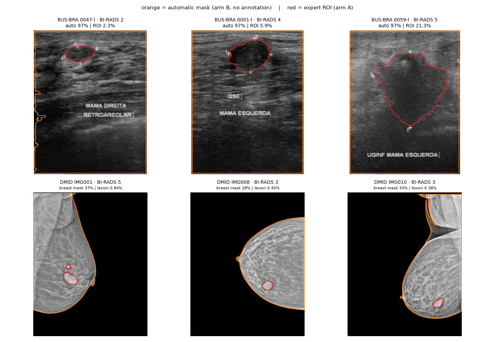
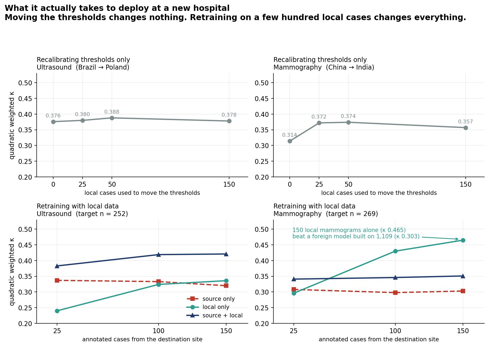

# Breast BI-RADS: multiple-instance learning, ordinal regression, and what survives an external site

An end-to-end study of whether BI-RADS can be learned from breast imaging without a radiologist
marking the lesion, and of what actually happens to such a model when it is moved to another
country. Multiple-instance learning over per-breast bags with an **ordinal** output head,
validated on a frozen patient-level holdout, then validated **externally on 2,447 breasts in a
second country** and again on a third cohort in a third country.

The headline result of the project is not an accuracy number. It is this: **every internal number
in this project overestimates**, and the study contains the experiments that prove it.

> **A note on scope.** This project is a commercial asset. Implementation details and source code
> are withheld; what follows is the methodology and the complete set of results, with nothing
> trimmed or rounded in the project's favour. Code and trained weights are available under NDA for
> evaluation purposes.

---

## 1. What was built

A per-breast BI-RADS risk model for mammography, plus a parallel ultrasound model, both trained
end to end on **public research datasets only** — no in-house patient data at any point.

**Multiple-instance learning.** A breast is not one image. It is a bag of views (CC, MLO, and in
ultrasound several sweeps), and the BI-RADS label belongs to the breast, not to any single frame.
The model therefore consumes a bag of instances and learns an attention-weighted pooling over
them, so the label is never forced onto an individual view that may not contain the finding at
all. The encoder is a biomedical vision-language backbone (BiomedCLIP) fine-tuned for the task;
the head is ordinal.

**Ordinal, not multiclass — and why that choice matters.** BI-RADS is an *ordered* scale: 2 is
less suspicious than 3, which is less suspicious than 4. A softmax multiclass head treats a
2 → 5 error exactly like a 4 → 5 error, which is clinically absurd — one is a near miss, the
other sends a benign finding to biopsy. The deployed model instead learns the cumulative
structure of the scale, one binary decision per cut point (`is this breast above category k?`),
so that the loss knows how far wrong a mistake is and the output is a coherent distribution over
an ordered scale rather than six unrelated logits.

**A second ordinal formulation was tried, pre-registered, and rejected.** CORN (Conditional
Ordinal Regression for Neural networks, Shi, Cao & Raschka 2021) replaces the independent
cumulative heads with *conditional* ones — each head models P(y > k | y > k−1) and is trained
only on the cases that reached that point, so the cumulative function is monotone by
construction. It was run as a full five-fold experiment against the same frozen holdout, with the
acceptance rule fixed in writing **before the result was known**: adopt it only if exact-category
accuracy gains at least 5 points with no rise in undercalling.

Both heads scored on the same frozen holdout, under the same issuing policy:

| Ordinal head (n = 495 breasts) | Exact category | Within ±1 | Quadratic weighted κ | AUC (≥ 4) |
|---|---|---|---|---|
| Cumulative binary decomposition (**deployed**) | 0.453 | **0.869** | **0.730** | **0.880** |
| CORN (challenger) | **0.481** | 0.834 | 0.676 | 0.863 |

CORN gained 2.8 points of exact accuracy — half the pre-registered bar — and paid for it in
within-±1 agreement, weighted κ and AUC. It gets the exact category right more often, but **when
it is wrong it is wrong by further**, which on an ordered scale is a change for the worse. The
hypothesis was falsified by its own experiment and the challenger was dropped. Its weights were
kept in case the acceptance criterion ever changes.

---

## 2. Internal results, and how to read the accuracy number

Deployed mammography model, frozen patient-block holdout of **495 breasts**:

| Metric | Value |
|---|---|
| AUC, BI-RADS ≥ 4 (the biopsy / work-up decision) | **0.880** |
| Quadratic weighted κ over the full 6-category scale | **0.730** |
| Within ±1 category | **0.869** |
| Exact category | 0.453 |
| Unweighted κ over 6 categories | 0.308 |
| **κ at the decision boundary (≥ 4)** | **0.595** |
| Undercall rate for BI-RADS ≥ 4 under the issuing policy | 0.117 |



**Exact-category accuracy of 0.45–0.50 looks bad until you ask what it should be compared with.**
Three points, in order of importance:

1. **It is not below a naive baseline.** The majority category in this holdout is BI-RADS 2, at
   150 of 495 cases — a constant predictor scores **0.303**. The deployed model scores 0.475 by
   argmax (0.453 under the issuing policy) and the CORN variant 0.503. Both beat always-guessing
   by a wide margin. (A related diagnostic, the *mean probability mass the model places on its own
   modal category*, is 0.579 for CORN and 0.625 for the deployed head — that is a measure of how
   peaked the predicted distribution is, not a baseline to beat, and it is easy to mistake for
   one.)

2. **On an ordered scale, how far wrong matters more than whether wrong.** The model lands within
   one category **86.9%** of the time and reaches a quadratic weighted κ of **0.730**. Errors
   cluster next door, which is the behaviour a downstream workflow can absorb; the exact-match
   metric throws that information away by construction.

3. **The reference standard is one human, and humans do not agree with each other either.** In a
   published study of 21 expert readers, inter-radiologist agreement on the 6-category BI-RADS
   assignment is **κ = 0.37** unweighted, and **κ = 0.53** once collapsed to "does this need
   further work-up". The model reaches **0.308** on the first and **0.595** on the second. At the
   decision that actually changes patient management, it agrees with the reporting radiologist
   **more than radiologists agree with each other**. Chasing higher exact-category accuracy
   against a single-reader label is chasing consistency that the experts themselves do not have.

This is why the product output was reframed, in writing, away from "issues a BI-RADS category"
and toward "issues a risk for the ≥ 4 decision, plus a category *range* with guaranteed
coverage". An audit of the emitted categories against the ACR malignancy bands supported that
change and is reported in the limitations below.

---

## 3. External validation — the part almost nobody does

Two independent external evaluations were run, on two modalities, across three countries. Neither
model was retrained or refitted for them.

### 3.1 Mammography, Mexico → China, n = 2,447

The deployed model, same weights, evaluated on an entirely separate national cohort.

| | Internal holdout | External cohort |
|---|---|---|
| AUC, BI-RADS ≥ 4 | 0.880 | **0.807** [0.790 – 0.825] |

The discrimination holds up reasonably. The **operating points do not**. Carrying the triage
thresholds over unchanged:



| Triage lane behaviour on the external cohort | Thresholds imported | Recalibrated on 150 local cases |
|---|---|---|
| Urgent lane workload | **94.4%** | 43.1% |
| Urgent lane PPV | 46.0% | 69.8% |
| Urgent lane capture of actionable cases | 99.7% | 67.5% |
| Rule-out lane workload | 0.04% | 15.4% |
| Rule-out lane actionable cases missed | 0.0% | **3.2%** (worst draw 10.5%) |

Imported unchanged, the urgent lane swallows **94% of the entire worklist at 46% precision** — a
triage system that flags almost everything ranks nothing, and is operationally worthless
regardless of its AUC. Recalibrating the thresholds on 150 local cases buys back a usable lane,
and the honest price is visible in the same table: capture falls to 68% and 3.2% of actionable
cases land in the rule-out queue. A distribution-shift monitor fires correctly on a 50-study
batch (p ≈ 1.5 × 10⁻¹⁸), i.e. the system can at least tell that it is out of its domain.

### 3.2 Ultrasound, Brazil → Poland, n = 252



| | Internal holdout | External site |
|---|---|---|
| AUC, BI-RADS ≥ 4 | 0.940 | **0.773** [0.701 – 0.839] |
| Quadratic weighted κ | 0.720 | **0.333** |
| Within ±1 category | 0.906 | 0.825 |
| AUC for pathology-proven malignancy | — | 0.810 |

The AUC drops 0.167 and the weighted κ is cut in half. Risk *ordering* survives — malignancy AUC
0.810 against actual pathology — but *category assignment* collapses. The model over-assigns
BI-RADS 5 (115 predicted against 46 real), and its category 5 contains 62.6% malignancy where the
local radiologist's contains 87.0%.

### 3.3 The methodological consequence

**A patient-level frozen holdout controls leakage. It does not control domain shift.** Every
internal figure in this project — cross-validation and holdout alike — overestimates what would
happen at a new site. To make a product decision you have to hold out an entire *dataset*, not
merely entire patients. This conclusion is drawn from the project's own numbers and it cuts
against the project's own headline figures.

---

## 4. Two methodological findings

### 4.1 The expert's contour leaks the expert's judgement

The study's organising question was: does learning BI-RADS require the radiologist's region of
interest? Five arms were run against a single holdout that was frozen by patient (seed fixed, 213
of 1,064 cases), locked **before any feature was extracted**, and hash-verified at every
evaluation.



| Arm | What it is | CV (dev) | Holdout AUC | 95% CI |
|---|---|---|---|---|
| **A** · expert ROI | radiomics on the radiologist's mask | 0.930 ± 0.018 | **0.940** | [0.913 – 0.963] |
| **D** · fine-tune, no ROI | backbone unfrozen, whole image | 0.859 ± 0.009 | 0.834 | [0.794 – 0.876] |
| **A'** · pseudo-ROI | radiomics on a detector mask (Dice 0.84) | 0.823 ± 0.021 | 0.798 | [0.752 – 0.844] |
| **C** · frozen embedding | pretrained features, no training | 0.801 ± 0.019 | 0.760 | [0.711 – 0.807] |
| **B** · automatic mask | radiomics on the whole breast | 0.742 ± 0.028 | 0.739 | [0.688 – 0.791] |

Paired differences on the holdout: **A − A' = +0.142** [+0.100, +0.184] · **A − D = +0.106**
[+0.068, +0.149]. The same ranking was confirmed on a second modality (mammography, DMID, 269
lesions): A 0.850 holdout against B 0.790 and C 0.758, with paired-CV differences A − B = +0.153
(p = 0.014) and A − C = +0.152 (p = 0.008).

The expert ROI is worth a great deal — and it does not survive automation. A detector with Dice
0.84 (median 0.91, 92% of images above 0.5) recovers only 0.798 of the 0.940. Radiomics is
hypersensitive to the exact contour.

**Then the ablation that matters.** Restricting arm A to only the **23 shape descriptors** of the
drawn region:



| Arm A, feature subset | Holdout AUC |
|---|---|
| All features | 0.940 |
| **23 shape features only** | **0.923** |
| Shape features removed | 0.852 |

The classifier is reading, above all, **the shape of the outline the radiologist chose to draw**.
Whoever traces a spiculated margin already knew it was spiculated. Part of that 0.940 is the
annotator's judgement leaking into the model through the mask — a subtle, structural form of
label leakage that most radiomics papers do not test for and therefore do not detect. **That
0.940 is not reachable in production**, where nobody draws the contour. Any material quoting it
without that caveat would be quoting a number this project itself refutes.



*Red: the expert's traced ROI (arm A). Orange: the automatic mask covering the whole field or
whole breast (arm B). The burned-in annotations visible in the ultrasound frames are part of the
public source data.*

### 4.2 The decision rule was written down before the result was seen

The route choice for the whole project was pre-registered: **if the pseudo-ROI arm came in below
0.80, the right path is the ROI-free fine-tune.**

It came in at **0.798**. Two thousandths below the line — precisely the situation in which it is
tempting to relitigate the threshold. The rule was honoured and the ROI-free fine-tune was
adopted, with arm A retained as a theoretical ceiling and comparator rather than as the product.
The decision was independently supported by data economics: image-level BI-RADS labels are
abundant (~595,000 available), lesions with expert masks are not (~8,600, only some
commercially licensable).

The same discipline killed the CORN head in section 1, and it is the reason the results in this
repository can be read at face value: the acceptance criteria were fixed while the outcome was
still unknown, and both times the author's own preferred hypothesis was the one that lost.

---

## 5. Transfer and deployment: what a new hospital actually needs

If a model's numbers do not survive a change of site, the operational question becomes: what is
the cheapest intervention that restores them?



**Recalibrating the thresholds alone does not work.** Freezing the source model and re-situating
only the category cut points with *k* local cases leaves weighted κ essentially flat:

| Local cases | Ultrasound (Brazil → Poland) | Mammography (China → India) |
|---|---|---|
| 0 | 0.376 | 0.314 |
| 25 | 0.380 | 0.372 |
| 50 | 0.388 | 0.374 |
| 150 | 0.378 | 0.357 |

**Retraining with local data does.** Weighted κ / AUC(≥ 4) at the destination:

| Local cases | Source only | Local only | Source + local |
|---|---|---|---|
| *Ultrasound, target n = 252* | | | |
| 25 | 0.337 / 0.774 | 0.240 / 0.698 | **0.383** / 0.774 |
| 100 | 0.333 / 0.770 | 0.324 / 0.756 | **0.419 / 0.785** |
| 150 | 0.320 / 0.760 | 0.336 / 0.782 | **0.421** / 0.781 |
| *Mammography, target n = 269* | | | |
| 25 | 0.308 / 0.747 | 0.296 / 0.689 | 0.341 / **0.783** |
| 100 | 0.298 / 0.747 | **0.430** / 0.771 | 0.346 / **0.802** |
| 150 | 0.303 / 0.747 | **0.465** / 0.796 | 0.351 / **0.814** |

The single most consequential row: in mammography, **150 locally annotated cases trained on their
own (κ 0.465) beat a foreign model trained on 1,109 mammograms (κ 0.303)** — and the curve is
still rising. Mixing source and local data always gives the best AUC (up to 0.814), but in
mammography it dilutes κ, because it drags along the distorted category prior of the source
cohort.

**The deployment consequence.** Public data is a good starting point for the *ordering* (AUC) and
a poor one for the *category*. Category assignment has to be learned at the destination, and a
few hundred locally annotated cases beat any imported model. In practical terms the asset is the
destination site's data, not the weights.

---

## 6. Declared limitations

Stated plainly, because they are the point of the exercise:

- **All internal figures overestimate.** Demonstrated, not suspected — see section 3. Nothing in
  this repository should be read as an estimate of performance at an unseen site.
- **The 0.940 is contaminated by annotator judgement** (section 4.1) and is not an achievable
  production number.
- **The reference standard is a single reader**, with no pathology in the main mammography
  cohort. The model is measured on agreement with *that* reader, not on truth, and it therefore
  inherits that reader's biases as well as their signal.
- **The emitted BI-RADS category does not respect the ACR malignancy bands** in the low
  categories: on the internal ultrasound holdout, predicted BI-RADS 2 carries 4.1% observed
  malignancy [2.1 – 7.9] against an ACR band of 0%, and predicted 3 carries 21.7% [9.7 – 41.9]
  against a band of 0 – 2%. This is why the product output was reframed from category issuance to
  risk plus a covered range. (The external mammography cohort is cancer-enriched, so the ACR
  screening bands do not apply there as written; the ultrasound deviation has no such excuse.)
- **The mammography split unit is not a true patient ID.** That dataset does not publish one, so
  patient blocks were reconstructed from the metadata. It is a documented weakness of the split,
  not a hidden one. One lesion-level mammography dataset splits by image, with residual leakage
  declared and unresolvable.
- **Retrospective, public, single-operator.** No prospective study, no clinical site, no PACS
  integration, no reader study on the same data. Technology readiness is laboratory validation,
  and the honest ceiling of the current evidence.
- **Ultrasound and mammography do not generalise to MRI**, and nothing here was tested on it.

---

## 7. Data

All datasets are public, research-licensed and already de-identified; each is cited by name.

| Dataset | Modality | Role here |
|---|---|---|
| **BUS-BRA** (Brazil, 1,875 images / 1,064 patients) | breast ultrasound | development and frozen holdout for the five-arm experiment |
| **Mammo-MX** (Mexico) | full-field digital mammography | development and frozen holdout for the MIL model |
| **BrEaST-Lesions-USG** (Poland, 252 cases) | breast ultrasound | external validation, ultrasound |
| **TOMPEI-CMMD** / **CMMD** (China, 2,447 breasts evaluated) | full-field digital mammography | external validation, mammography |
| **DMID** (269 lesions) | mammography | cross-modality confirmation of the arm ranking |

Licence review was carried out per dataset; all datasets used permit the intended use with
attribution.

---

## 8. Stack

PyTorch · multiple-instance learning with attention pooling · ordinal regression (cumulative
binary decomposition; CORN as the rejected challenger) · BiomedCLIP vision-language backbone ·
radiomic feature extraction (MIRP, IBSI-aligned) · scikit-learn · conformal prediction sets for
the emitted category range · bootstrap confidence intervals and paired cross-validation tests ·
a Kolmogorov–Smirnov distribution-shift monitor.

---

## 9. Files here

```
metrics/
  mil_ordinal_holdout.json            deployed head and rejected CORN challenger, same holdout
  external_validation_mammography.json  n = 2,447, imported vs recalibrated triage lanes
  external_validation_ultrasound.json   Brazil -> Poland, with per-category malignancy rates
  five_arm_comparison.csv             the five arms, both modalities, CV and holdout with CIs
  annotator_leakage_ablation.csv      shape-only and shape-removed ablation of the expert ROI
  local_data_transfer_curves.csv      threshold recalibration vs retraining, by local sample size
assets/
  fig1_five_arms.png                  five-arm forest plot with the pre-registered 0.80 line
  fig2_annotator_leakage.png          where the 0.94 comes from
  fig3_external_degradation.png       internal vs external, both modalities
  fig4_triage_thresholds.png          imported vs recalibrated operating points, n = 2,447
  fig5_local_data_curves.png          what a new hospital needs
  fig6_ordinal_metrics.png            reading exact-category accuracy correctly
  roi_vs_automatic_mask.png           expert ROI against automatic mask, both modalities
```

Trained weights are not included; they are **available on request**.
