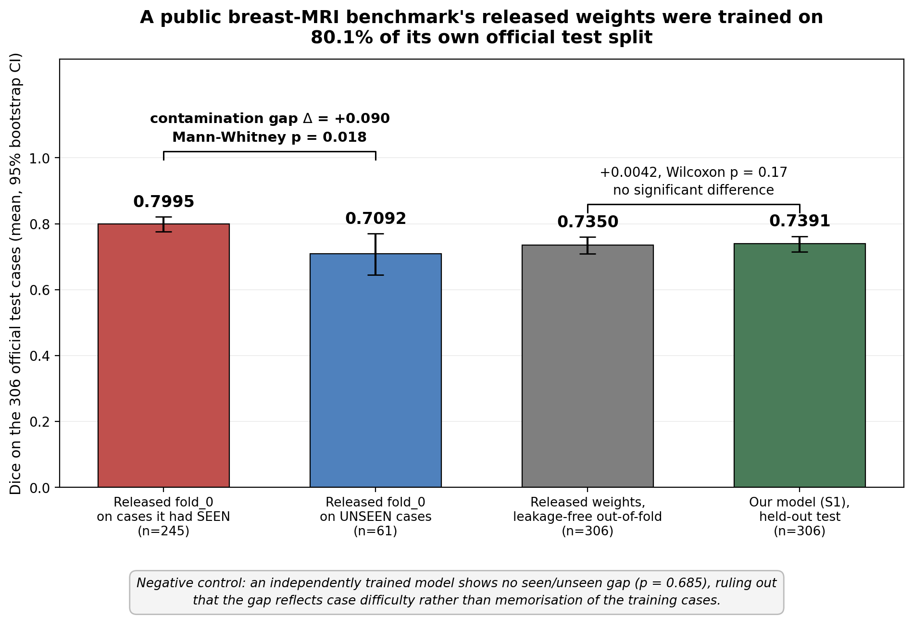
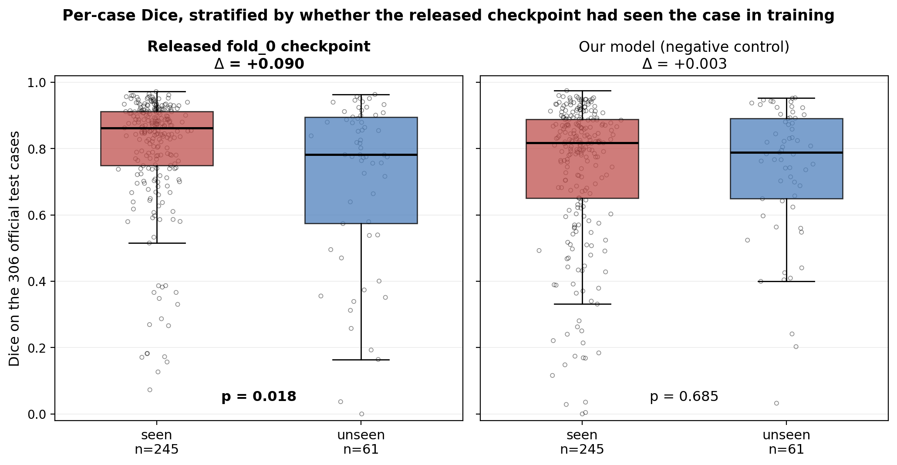

# Breast Tumor Segmentation on DCE-MRI — and a Contaminated Public Benchmark

Two connected pieces of work on the public
[MAMA-MIA](https://www.synapse.org/Synapse:syn60868042) breast DCE-MRI dataset
(1,506 cases, four cohorts: DUKE, ISPY1, ISPY2, NACT — all TCIA-derived and
already de-identified):

1. **A 3D tumor segmentation model** trained under the dataset's official
   train/test split and scored once on the closed test set.
2. **A benchmark-integrity finding**: the pretrained weights the dataset
   distributes were trained on **80.1% of its own official test split**, which
   inflates every comparison made against them.

The second piece is the one that matters. It also *removed* the apparent
advantage of the first — that reversal is reported below rather than buried.

---

## 1. The segmentation model

| | |
|---|---|
| Architecture | [nnU-Net](https://github.com/MIC-DKFZ/nnUNet), `3d_fullres`, single fold |
| Input | 2 channels — pre-contrast and first post-contrast phase, native spacing |
| Training | 1,200 official training cases only, 1,000 epochs, single RTX 6000 Ada |
| Checkpoint | frozen, sha256 recorded before evaluation |
| Evaluation | the 306 official test cases, scored once, never used for selection |

### Results on the closed held-out test set (n = 306)

| Metric | Value |
|---|---|
| Dice, mean | **0.7391** |
| Dice, median | **0.8162** |
| Dice, SD | 0.2128 |
| Cases with Dice < 0.5 | **43 / 306 (14.1%)** |
| Cases with Dice < 0.3 | 19 / 306 |

The mean sits well below the median because the error distribution has a long
left tail: most cases segment cleanly, and a minority fail outright. Those 43
failures are the honest headline of the model. Per-case Dice, HD95 and
ground-truth tumor volume for every one of the 306 cases are in
`metrics/test_results_s1.json`, so the failure cases can be inspected
individually rather than taken on trust.

Performance is strongly cohort-dependent — DUKE is markedly harder than the
rest for every model tested, including the released weights:

| Cohort | n | This model | Released weights (leakage-free) |
|---|---:|---:|---:|
| DUKE | 91 | 0.6216 | 0.6566 |
| ISPY1 | 67 | 0.7667 | 0.7312 |
| ISPY2 | 131 | 0.7973 | 0.7887 |
| NACT | 17 | 0.8121 | 0.7553 |

A second variant was trained with three DCE phases fed as single-channel
samples (3,600 samples instead of 1,200). It performed **worse** — 0.6852 mean
Dice, 74 failures — because the extra phases are correlated views of the same
patient and mask, not independent samples. Negative results are kept in
`metrics/per_case_dice_3way.json` alongside the rest.

---

## 2. The benchmark contamination finding

MAMA-MIA ships both an official 1,200 / 306 train/test split **and** pretrained
nnU-Net weights. The two artifacts are mutually incompatible.

### How it was found

Each released fold ships a per-case validation metrics CSV. In nnU-Net, a
fold's validation list is exactly the complement of its training set. Crossing
the `fold_0` validation list against the official split shows:

- `fold_0` validation list: **304** cases — of which only **61** are in the
  official test split, and 243 in the official training split.
- The fold was therefore trained on the other 1,202 cases of the corpus, which
  include **245 of the 306 official test cases (80.1%)**.

### The effect is measurable, and it is not case difficulty

Running the released `fold_0` checkpoint over all 306 official test cases and
stratifying by whether it had seen the case in training:

| Stratum | n | Dice (released `fold_0`) |
|---|---:|---:|
| **Seen** during training | 245 | **0.7995** |
| **Unseen** | 61 | **0.7092** |
| Gap | | **+0.090**, 95% CI [+0.027, +0.157], Mann-Whitney **p = 0.018** |

The obvious objection is that the unseen 61 might simply be harder cases. Two
checks rule that out:

- **Negative control.** An independently trained model that saw *none* of the
  306 shows no gap across the same two strata: +0.003, **p = 0.685**. If the
  strata differed in difficulty, the control would show the gap too.
- **Group comparability.** The strata do not differ in cohort composition
  (χ², p = 0.231) or ground-truth tumor volume (5.3 vs 6.4 mL, p = 0.466).





### Recovering a usable number

The five released folds partition the corpus, so every one of the 306 test
cases appears in exactly one fold's validation list (61 + 51 + 62 + 55 + 77 =
306). Each case can therefore be scored with the fold that did *not* train on
it, using the authors' own published per-case metrics. That out-of-fold
aggregate is the leakage-free figure:

| On the 306 official test cases | Dice mean | Median | Dice < 0.5 |
|---|---:|---:|---:|
| Released weights, contaminated `fold_0` | 0.7815 | 0.8526 | 30 |
| **Released weights, leakage-free out-of-fold** | **0.7350** | 0.8210 | 46 |
| This model (S1) | 0.7391 | 0.8162 | 43 |

Contamination is worth roughly **4.7 Dice points** of headline performance for
the released checkpoint on this split.

---

## 3. What this does to my own result — stated plainly

Against the **contaminated** checkpoint, my model looked clearly worse:
−0.0423, p = 3.6 × 10⁻⁸. That conclusion was an artifact of the leakage.

Against the **leakage-free out-of-fold** baseline, the comparison is:

> **+0.0042, Wilcoxon p = 0.17 — no significant difference.**
> Per-case, counting a difference of |ΔDice| ≤ 0.01 as a tie: 135 wins,
> 69 ties, 102 losses.

**This model does not beat the baseline. It ties it.** Two input channels
bought no measurable advantage over the released approach, and I am not
claiming otherwise. The contribution here is not a better segmenter; it is
having established that the published comparison point was inflated, and by
how much.

The leakage-free out-of-fold figure (0.7350) also sits below the
0.762 ± 0.211 that the dataset paper reports as its five-fold
cross-validation result.

---

## 4. Why this generalizes beyond one dataset

The failure mode is structural, not a mistake of bad faith: the weights were
trained on the whole corpus to maximize clinical utility, and the official
split was published separately, with no warning that the two do not compose.
Any downstream group that evaluates on that split and compares against those
weights is measuring memorization, not generalization — and would have no way
of noticing.

The audit is cheap and reusable wherever a benchmark ships both a split and
pretrained weights:

1. Recover each fold's training set from the artifacts it publishes (for
   nnU-Net, the complement of its validation list).
2. Intersect with the official test split. Quantify the overlap.
3. Stratify the evaluation by seen/unseen and test the gap.
4. **Run a negative control** — a model that saw none of the test cases. Without
   it, a seen/unseen gap is confounded with case difficulty and proves nothing.
5. If the folds partition the corpus, recover a leakage-free estimate
   out-of-fold instead of discarding the benchmark.

## Status and reproducibility

A manuscript describing the finding is **prepared for preprint submission to
medRxiv — it is not published or peer-reviewed**, and should not be cited as
such.

The finding reproduces from public artifacts alone: the MAMA-MIA dataset and
the released weights (both CC-BY-NC). Steps 1–3 above need no GPU and no
retraining — the released per-fold CSVs and the per-case Dice files in
`metrics/` are sufficient. Training the negative-control model and running
inference do require the raw imaging and a GPU.

All datasets used are CC-BY-NC and this is non-commercial research. No model
trained on them has been or will be deployed commercially without a separate
licence from the dataset owners.

## Contents

```
metrics/
  test_results_s1.json          per-case Dice, HD95, GT volume for this model (n=306)
  per_case_dice_3way.json       per-case Dice: this model, the 3-phase variant,
                                and the released fold_0 checkpoint (n=306)
  leakage_strata_per_case.csv   per case: seen/unseen flag, released fold_0 Dice,
                                released out-of-fold Dice, this model's Dice
  verified_figures.json         every reported figure, with input file hashes
assets/
  benchmark_contamination.png   the four-way comparison
  seen_vs_unseen_distributions.png   per-case distributions with negative control
```

Case identifiers are the public, de-identified TCIA-derived MAMA-MIA IDs
(`DUKE_019`, `ISPY2_xxx`, …). No patient-level data is included.
