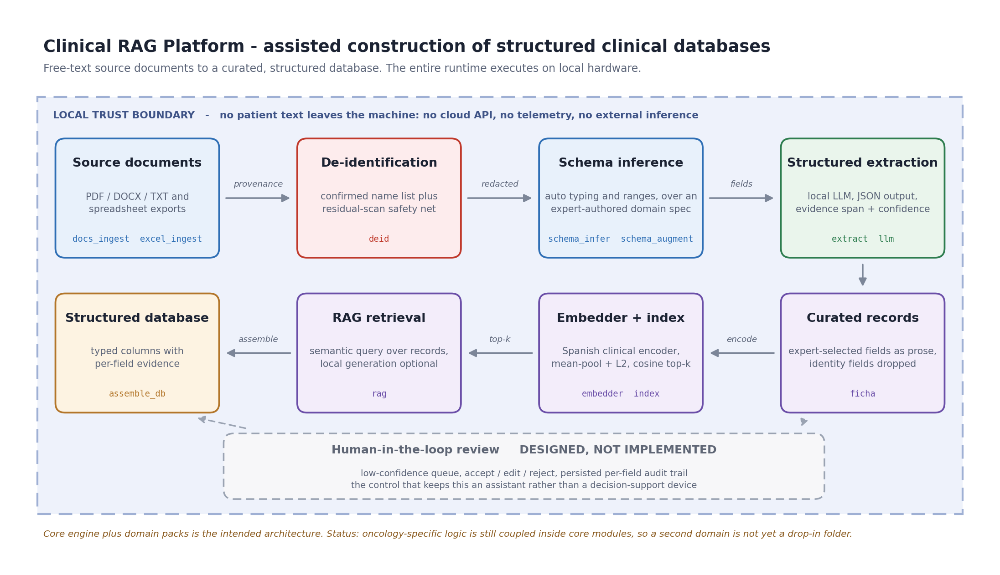

# Clinical RAG Platform

A local, privacy-first platform for **assisted construction of structured clinical databases**:
free-text source documents in, a curated and typed database out, with a clinician reviewing the
machine's proposals rather than trusting them.

Built as a **core engine + domain packs**. The first domain pack is radiation oncology
(spatially fractionated radiotherapy).



> **Read this first — status.** This is a **TRL 3** experimental proof of concept, not a product.
> It was formally audited in August 2026 and several earlier claims did not survive that audit.
> The honest limitations are stated in [Status and limitations](#status-and-limitations) below,
> and they are not footnotes: **no quality claim in this system has yet been measured against
> annotated ground truth.** What follows is a systems-engineering portfolio piece about
> architecture and design decisions, not a validated result.

---

## What problem it solves

Clinical research databases are still largely built by hand: a researcher reads reports and
retypes values into a spreadsheet. That is slow, and it is where transcription errors enter the
dataset.

This platform proposes each structured value **together with the verbatim text span that
justifies it and a confidence score**, so the reviewing clinician checks a proposal against its
evidence instead of re-reading the whole document. The design principle throughout is
*assistant, not autopilot*.

---

## Architecture

Core engine (`engine/`), domain packs (`domains/<case>/`):

| Module | Role |
| --- | --- |
| `docs_ingest` | PDF / DOCX / TXT to text, with **page-level provenance** |
| `excel_ingest` | Spreadsheet consolidation: grouped multi-row headers, duplicate column names, Excel error values |
| `deid` | De-identification of Spanish clinical text |
| `schema_infer` / `schema_augment` | Per-column type, range and category inference; alternative-class proposal |
| `domain_spec` | Curated variable specification for a domain pack |
| `extract` / `llm` | Free-text to structured fields via a local LLM |
| `ficha` | Serialization of a case into the curated natural-language record that gets embedded |
| `gen_pairs` | Query/record training pair generation for domain adaptation |
| `embedder` / `index` | Spanish clinical sentence embeddings; exact cosine top-k |
| `rag` | Retrieval over records, with optional local generation |

---

## Design decisions worth discussing

### 1. Clinical domain expertise is the actual differentiator

The schema, the curated records and the corrections applied to the model's output were produced
**manually, by hand, by the author — a physician with three years of radiation oncology training — applying his
own clinical experience.** None of it is auto-generated. This is the core claim of the project
and it is deliberate: the moat here is not the model and not the retrieval algorithm. The
fine-tuning runs in seconds on commodity hardware and anyone can reproduce it. What is not
commodity is a clinician deciding, case by case, **which variables actually matter, in what
vocabulary they should be expressed, and what the correct range is** — and then reading the
model's extractions and correcting them against clinical judgement rather than accepting them.

Three concrete places where that shows:

**The curated schema beats what inference alone would produce.** The hand-curated domain
specification carries **11 variable groups and 59 variables**, with types, units, multi-moment
modelling (9 variables are tracked at several timepoints) and declared clinical scales:
RECIST 1.1 response categories, CTCAE toxicity grade 0-5, ECOG performance status 0-4.
Automated schema inference reads categories off the observed data, so for toxicity grade it
would have emitted only the classes actually present in this cohort. The curated schema
declares the **full CTCAE 0-5 range**, because the scale is defined by the standard, not by
which grades this cohort happened to contain. Similarly, ECOG carries an explicit note not to
conflate it with the Karnofsky index — a distinction only a clinician thinks to flag.

**The curated record beats the raw record for retrieval.** The embedded document per case is not
a dump of every column. It is a hand-picked selection of the clinically discriminative fields,
rendered as prose with clean labels. The rationale, recorded in the code, is that dumping every
column drowns the signal: repeated numeric quality-of-life instrument arrays dominate the
embedding and flatten the distinctions that actually matter. Selecting the fields is a clinical
judgement, and it is applied *before* any model sees the text.

> **Honesty note.** A head-to-head "raw record vs. curated record" comparison was scripted, but
> it left no logged output, so the size of that improvement is **an untested hypothesis, not a
> measured result**. The design rationale is documented; the number is not. Producing it is
> pending work.

**The model's output was corrected by hand, on clinical criteria.** The extractions were not
taken at face value. The author read them and corrected them, and those corrections fed back
into the system as design: the abbreviation glossary and the few-shot examples that steer the
extractor encode resolutions a clinician makes automatically and a general-purpose model does
not — that a given Spanish oncology acronym implies a specific histology *and* a specific
primary site, which abbreviations mark laterality, how a subtype should be named. The same
applies to the query vocabulary used for domain adaptation (section 3): the paraphrases are
clinical synonyms authored from experience, deliberately not copied from the records.

> **Two different things, and they must not be conflated.** The above is the **author's working
> method** — expert human curation carried out *during development*, which is where this
> project's value sits. It is **not** the same as the system's **human-in-the-loop review
> feature**, which is *designed but not implemented* (see limitation 5). The platform does not
> today offer a reviewer a low-confidence queue or a per-field audit trail. A clinician curated
> the inputs and corrected the outputs by hand; the software does not yet provide the interface
> that would let someone else do so.

### 2. Privacy is an architectural decision, not a feature

The entire runtime executes locally. The extractor is a **12B-parameter instruction model served
by a local Ollama daemon**; the retriever is a local sentence encoder. There is no cloud API, no
telemetry, no external inference call anywhere in the pipeline. Clinical text never leaves the
machine, which is what makes it defensible to point this at real hospital data at all.

De-identification is treated as a **verified-list problem, not a guessing problem**. The
observed failure mode in real Spanish hospital corpora is specific: exports scrub the
*structured* identifiers (ID numbers, phone, record number) and leave *names* untouched in
headers, footers, signatures and narrative. So the module harvests name candidates only from
contexts where a name is structurally marked (signature blocks, "report author:" lines, role
annotations), a human confirms the list, and redaction is then exact-match over every ordering
of each confirmed name. A purely statistical detector produces false positives on
all-caps clinical narrative and false negatives on rare surnames; a confirmed list does neither.

**The pipeline audits its own de-identification rather than assuming it.** The corpus
de-identification run goes from source documents to redacted text in a single pass and leaves
four separable artefacts: the extracted raw text, explicitly labelled as *still containing
personal data*; the detected person list, written out to be
**confirmed by a human before redaction is trusted**; the redacted text,
which is the only thing permitted into the index; and a **residual report** from a
`residual_scan` pass that flags every fragment still *shaped* like a name and absent from the
confirmed list. Anything genuinely missed goes onto the list and the run repeats.

That last artefact is the point, and it is worth being precise about what it does and does not
establish. Work on this project was carried out on **de-identified material**, and the
de-identification stage is part of the pipeline by design — but this README makes **no claim
that the source material is fully anonymised**. The opposite: the project's own privacy report
currently shows **open residual findings on incoming material**, including clinician names
surviving in files supplied pre-labelled as anonymised. That is precisely the failure mode
described above, caught by the tool built to catch it. The defensible claim is therefore the
narrow one — *the system measures its own residual identifiers and reports them*, and only
redacted text reaches the index — not the broad one that the data is clean.

### 3. Adapting a Spanish clinical encoder for retrieval

The base model is `PlanTL-GOB-ES/roberta-base-biomedical-clinical-es`. It is a **masked-LM
encoder, not a sentence-transformer**, so out of the box it discriminates poorly for retrieval —
similarity scores come out flat. Two-stage adaptation:

1. **Bootstrap to a sentence embedder** — CoSENT loss over a Spanish STS corpus, which is the
   standard recipe for turning a Spanish encoder into a similarity model.
2. **Domain adaptation** — `MultipleNegativesRankingLoss` over (query, record) pairs, where the
   queries are built from **clinical synonyms and paraphrases authored by a domain expert**, not
   copied verbatim from the records. In-batch records serve as negatives.

Embeddings are mean-pooled and L2-normalised so the dot product is cosine. For cohorts of this
size an exact numpy top-k is correct and simpler than an approximate index; the module is
swappable for FAISS when volume justifies it.

### 4. An engineering detail: forced JSON mode was silently dropping fields

The extractor originally used the LLM server's **schema-constrained JSON output**. Optional
fields typed as a `string | null` union were being collapsed to `null` — the constrained decoder
was suppressing precisely the fields that were most often optional (histological subtype,
staging, laterality). The fix was to **drop forced JSON mode** and instead request free-form
JSON behind a tolerant parser that strips markdown fences and recovers the first balanced JSON
object. Recovering those fields was a decoding-strategy problem, not a prompting problem.

### 5. Regulatory position

For the current intended use — assisting a researcher to build a research database — the system
sits **outside the EU Medical Device Regulation** (no medical purpose under Art. 2(1), no benefit
to an individual patient under MDCG 2019-11) and **outside the AI Act's high-risk tier**
(Annex III has no general health point, and Art. 6(1) does not bite where there is no medical
device).

This position is conditional and worth stating plainly: it holds *only* while the tool does not
become clinical decision support. Cross that line and MDR Annex VIII Rule 11 applies, which means
class IIa at minimum and a notified body. The human-in-the-loop review step is the control that
keeps the system on the correct side of that boundary — and, as noted below, **it is designed but
not yet implemented**.

---

## Status and limitations

Findings from the formal audit of 2026-08-23. Read these as part of the project, not as
disclaimers appended to it.

**1. TRL 3.** An experimental proof of concept. Not a product, not deployed, not validated.

**2. The retrieval metric is not a defensible result.** An internal comparison shows mean
precision@5 moving from 0.33 to 0.60 between retriever versions. That number should **not** be
read as evidence of quality, for two independent reasons:

- **0.60 is the arithmetic ceiling of that metric on that set.** Two of the queried classes have
  exactly one instance in the cohort, so those queries can never exceed 1/5. Working the ceiling
  through the six queries gives exactly 0.60. The second retriever did not approach a good
  score; it *saturated a badly specified metric*.
- **The evaluation corpus is the training corpus.** The records used to score retrieval are the
  same records that served as positives during domain adaptation. The queries were held out; the
  documents were not. The number therefore cannot distinguish "solved" from "overfit".

The defensible framing is the one in section 3 above: the *fine-tuning technique* is sound and
worth discussing. **Rigorous evaluation — recall@k and MRR over held-out documents, against an
annotated golden set, with the split declared — is pending work and has not been done.**

**3. Not reproducible as it stands.** The evaluation script currently fails at exit code 1: a
video-decoding shared library pulled in transitively by the embedding stack fails to load in the
project environment, and there is no dependency lockfile that would rebuild a known-good
environment. A workaround is implemented in the embedder, but the environment itself is unfixed.
Nothing in this repository should be described as reproducible until that is resolved.

**4. The core is not yet domain-agnostic.** Despite the core-plus-domain-packs design, oncology
logic lives *inside* core modules: the domain specification is oncology-specific, the curated
record field list is hard-coded for the first domain pack, and the extractor carries a hard-coded
oncology abbreviation glossary and few-shot examples. **A second domain is not "just a new
folder"** — the honest acceptance test would be a second domain pack running the full chain with
an empty diff against `engine/`, and that test has not been passed.

**5. Human-in-the-loop is designed, not implemented.** There is no review UI, no low-confidence
queue and no per-field audit trail. This is the governing principle of the design and the control
that underpins the regulatory position above, and it does not exist in code yet.

**6. Extraction performance is uneven and unvalidated.** On a free-text-to-structured run over 38
diagnostic texts, the model recovered histology in 35, histological subtype in 24, and TNM
staging in 4. These are counts from a single run scored informally — **not** accuracy against an
annotated reference, and not a benchmark. The TNM figure mostly reflects that staging is simply
absent from most source text, which is itself a finding about the corpus rather than the model.

---

## Illustrative example

**Entirely fictional.** No real clinical text, no real record and no patient data appears in this
repository or in this example. The values below were invented to show the output shape.

Synthetic free-text input:

```
Fictitious example - not a real case
"CDI de mama izquierda, T2N1M0"
```

Structured output shape:

```json
{
  "histology": "Carcinoma",
  "histological_subtype": "infiltrating ductal",
  "location": "Breast",
  "laterality": "left",
  "tnm": "T2N1M0",
  "stage": null,
  "evidence": "CDI de mama izquierda, T2N1M0",
  "confidence": 0.95
}
```

Note the two fields that carry the design: `evidence` is the verbatim span the reviewer checks
the value against, and absent data yields `null` rather than a guess.

---

## Tech stack

Python · sentence-transformers · PyTorch · numpy · Ollama (local 12B instruction model) ·
pdfplumber · python-docx · openpyxl · PyYAML

---

## Scope of this portfolio entry

This directory documents architecture and engineering decisions only. **No clinical data, no
patient records, no source documents and no trained model weights are included here**, and no
data file was copied out of the source project to produce it.
