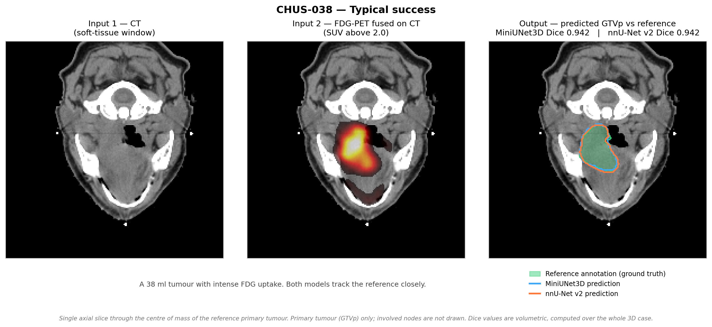
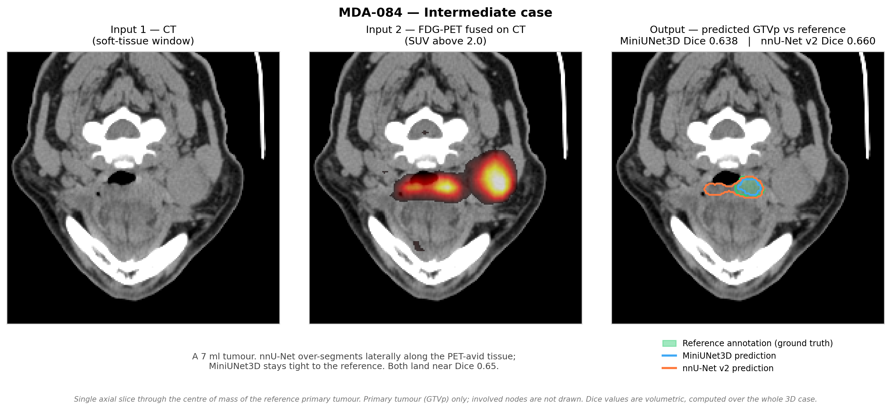
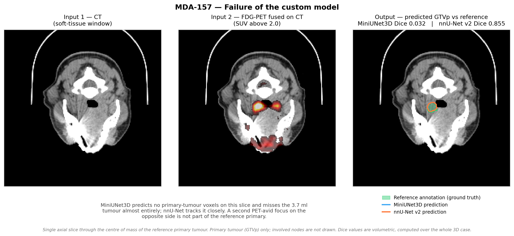
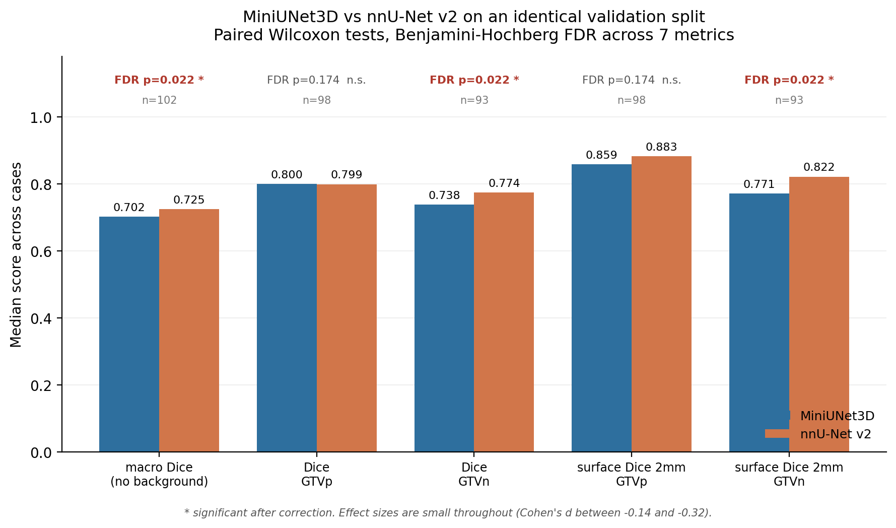
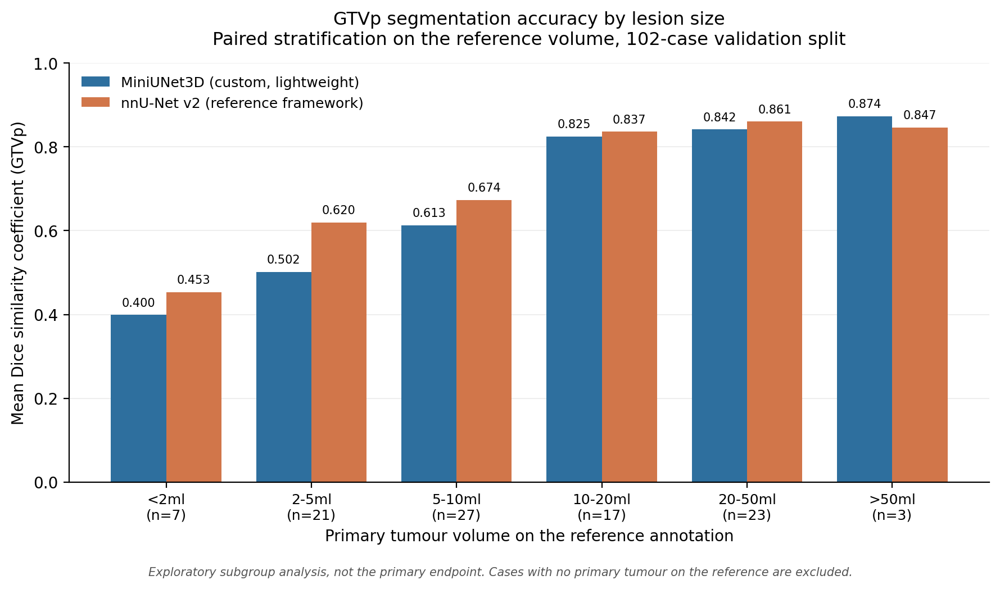

# Head and Neck Tumour Segmentation from PET/CT — a custom network benchmarked against nnU-Net v2

**HECKTOR 2025 Challenge, Task 1** — joint segmentation of the primary tumour (GTVp) and involved
lymph nodes (GTVn) from co-registered FDG-PET/CT.

This folder documents a head-to-head comparison between **MiniUNet3D**, a lightweight 3D
segmentation network I designed, and **nnU-Net v2**, the self-configuring framework that is the
de facto reference in medical image segmentation. Both models were trained on the same data and
evaluated on the **same 102-case validation split**, case by case, with paired statistics and
correction for multiple testing.

---

## What the models actually produce

Three validation cases, spanning the range of behaviour. Each figure shows both **inputs** (CT and
the fused FDG-PET) and the **output**: the reference annotation as a filled green region, with each
model's predicted primary tumour drawn as a contour over it. Dice values are volumetric, computed
over the whole 3D case, and were recomputed directly from the arrays being drawn.

**A typical success** — a 38 ml tumour with intense uptake, where both models agree with the
reference and with each other:

**An intermediate case** — a 7 ml tumour where the two models fail differently. nnU-Net extends
laterally along PET-avid tissue that the reference excludes; MiniUNet3D stays tight to the
reference but under-covers it elsewhere in the volume. Both land near Dice 0.65:

**A failure of the custom model** — the case that makes the point of the failure analysis below.
MiniUNet3D produces no primary-tumour voxels on this slice and misses the 3.7 ml tumour almost
entirely (Dice 0.032), while nnU-Net segments it accurately (Dice 0.855). Failures of this kind
are rare but they are **eight times more common** in the custom model than in nnU-Net:

Cases were chosen to span good, intermediate and failing behaviour rather than to flatter the
custom model; the failure shown is the custom model's, not nnU-Net's.

---

## Headline result, stated honestly

> A compact custom network **matches** the reference framework on the primary tumour and
> **loses** on lymph nodes. All effect sizes are small.

| | MiniUNet3D | nnU-Net v2 | verdict |
|---|---|---|---|
| Primary tumour (Dice GTVp) | 0.800 | 0.799 | **tie** — no significant difference (FDR p = 0.174) |
| Lymph nodes (Dice GTVn) | 0.738 | 0.774 | **nnU-Net wins** — significant after correction (FDR p = 0.022) |
| Macro Dice (no background) | 0.702 | 0.725 | **nnU-Net wins** (FDR p = 0.022) |

This is **not** a claim that MiniUNet3D beats nnU-Net. It does not. The result worth reporting is
that a much smaller, hand-designed network reaches parity on the harder-to-delineate primary
tumour, and that the gap on nodes, while statistically real, is small in magnitude
(Cohen's d = −0.32).

The contribution I would actually put forward is the **evaluation methodology**, described below:
paired testing, bootstrap confidence intervals, correction across seven metrics, a post-processing
ablation, and a failure-mode analysis. Several of those checks changed what I was willing to
conclude — including one that overturned an earlier, more flattering finding of my own
([see below](#a-correction-i-had-to-make-to-my-own-analysis)).

---

## Primary endpoints

Paired Wilcoxon signed-rank tests on the identical validation split. Values are **medians** across
cases. `p_Bonf` is the Bonferroni-corrected p-value and `p_FDR` the Benjamini–Hochberg corrected
p-value, both computed across all **seven** metrics tested. Negative `d` favours nnU-Net.

| Metric | N | MiniUNet3D | nnU-Net v2 | p_raw | p_Bonf | p_FDR | Cohen's d |
|---|---|---|---|---|---|---|---|
| macroDice_noBG | 102 | 0.702 | 0.725 | 0.010 | 0.067 | **0.022** | −0.16 |
| Dice_GTVp | 98 | 0.800 | 0.799 | 0.113 | 0.790 | 0.174 | −0.26 |
| Dice_GTVn | 93 | 0.738 | 0.774 | 0.006 | 0.041 | **0.022** | −0.32 |
| sDSC2_GTVp | 98 | 0.859 | 0.883 | 0.124 | 0.868 | 0.174 | −0.21 |
| sDSC2_GTVn | 93 | 0.771 | 0.822 | 0.007 | 0.049 | **0.022** | −0.25 |
| HD95_GTVp | 90 | 3.958 | 3.514 | 0.574 | 1.000 | 0.670 | −0.14 |
| HD95_GTVn | 93 | 12.154 | 11.811 | 0.778 | 1.000 | 0.778 | −0.16 |

`sDSC2` is the surface Dice at a 2 mm tolerance; `HD95` the 95th-percentile Hausdorff distance in
mm (lower is better). Case counts differ per metric because cases whose reference annotation
contains no structure of that class are excluded rather than scored — see
[Scoring decisions](#scoring-decisions).

**Reading of the table.** Three of seven metrics survive FDR correction, all favouring nnU-Net,
all on nodes or on the macro average that includes nodes. Nothing separates the two models on the
primary tumour, by either overlap or surface agreement. The distance metrics separate nothing at
all, and their confidence intervals are very wide — HD95 is dominated by a handful of outlier
cases in both arms.

**Effect sizes are small across the board.** |d| ranges from 0.14 to 0.32. With N ≈ 100 paired
cases, a significant p-value here means a small difference measured precisely, not a large one.
That distinction is the whole point of reporting d alongside p.

---

## Where the custom model is genuinely different: empty predictions

The one place the two models behave qualitatively differently is on cases where the reference
contains **no primary tumour at all** (n = 4 in this split).

| | MiniUNet3D | nnU-Net v2 |
|---|---|---|
| Tumour-absent cases correctly left empty | 3 / 4 | 0 / 4 |

nnU-Net produced a non-empty GTVp prediction on every tumour-absent case; MiniUNet3D abstained on
three of four. This is a real difference in false-positive behaviour and it is clinically relevant
— but n = 4 is far too small to conclude anything, and these cases are **excluded from the primary
endpoints above** precisely because Dice is ill-defined when the reference is empty.

I mention it because it is the honest version of a claim I initially got wrong.

### A correction I had to make to my own analysis

An earlier version of the volume-stratified analysis reported that on lesions under 2 ml
MiniUNet3D scored **0.527** mean Dice against nnU-Net's **0.277** — an apparent near-doubling on
small lesions, and by far the most attractive result in the study. It does not survive scrutiny,
for two independent reasons:

1. **The bins were built from each model's own predicted volume, not the reference volume.** The
   two "< 2 ml" bins therefore contained different sets of patients (only 9 of 11 overlapped), so
   the comparison was not paired at all.
2. **The advantage came entirely from tumour-absent cases.** Three of the eleven cases in that bin
   had no primary tumour on the reference. MiniUNet3D predicted empty and was scored Dice = 1.0;
   nnU-Net predicted something and scored 0.0. Those three free 1.0s produced the whole effect.

Re-binning on the **reference** volume, which keeps the comparison paired, and excluding
tumour-absent cases, the small-lesion advantage disappears and mildly reverses:
**0.400 vs 0.453** mean Dice at < 2 ml (n = 7). nnU-Net is ahead in every size bin except the
largest, where n = 3.

Both stratifications are shipped in `metrics/` so the discrepancy can be checked directly. The
corrected one is the one plotted.

This subgroup analysis is **exploratory**, not a pre-specified endpoint. Bin sizes run from 3 to
27 cases, no correction is applied within it, and it should be read as a description of where
error concentrates, not as evidence of a difference.

---

## Post-processing ablation

MiniUNet3D's raw output is not competitive. A deterministic post-processing stage — connected-
component filtering and volume-aware pruning — is what closes the gap, and its contribution is
larger than any architectural difference in the study.

| Metric | N | Raw output | After post-processing | Δ mean | p (Wilcoxon) |
|---|---|---|---|---|---|
| Dice_GTVp | 98 | 0.592 | 0.800 | +0.192 | 1.1 × 10⁻¹⁴ |
| Dice_GTVn | 93 | 0.598 | 0.738 | +0.184 | 8.9 × 10⁻¹⁶ |
| HD95_GTVp | 74 | 5.408 | 3.000 | −3.45 | 1.1 × 10⁻¹¹ |
| HD95_GTVn | 80 | 15.977 | 10.815 | −6.03 | 5.4 × 10⁻⁸ |

Against nnU-Net, the un-post-processed model loses decisively (Dice_GTVp 0.592 vs 0.799,
d = −0.88). Reporting the ablation makes clear that the parity claim on GTVp is a claim about
**the full pipeline**, not about the architecture in isolation — nnU-Net's own post-processing is
part of its default configuration, so this is the like-for-like comparison, but the attribution
matters.

---

## Failure-mode analysis

Aggregate scores hide catastrophic cases. Counting a case as a failure when Dice_GTVp < 0.01
(evaluable n = 98), and comparing the two arms with an exact McNemar test on the discordant pairs:

| Arm | Failures | Rate | Discordant (this arm only) | McNemar p vs nnU-Net |
|---|---|---|---|---|
| MiniUNet3D, raw | 25 | 25.5 % | 24 | 1.2 × 10⁻⁷ |
| MiniUNet3D, post-processed | 8 | 8.2 % | 7 | 0.016 |
| nnU-Net v2 | 1 | 1.0 % | — | — |

**nnU-Net is substantially more robust.** Post-processing cuts the custom model's catastrophic
failure rate from 25 % to 8 %, but an 8 % total-miss rate against nnU-Net's 1 % is a real
deployment-relevant weakness, and it is significant on a paired test. Every failure occurred on a
tumour of 7.6 ml or less, which is consistent with the volume stratification: both models are
fragile on small lesions, and the custom model more so.

This is the analysis that most changes how I would describe the model to a clinical collaborator,
and it is invisible in any table of mean Dice.

---

## Data and experimental setup

| | |
|---|---|
| Task | HECKTOR 2025, Task 1 — GTVp + GTVn segmentation |
| Input | Co-registered FDG-PET and CT, 2 channels, resampled to 1.5 mm isotropic |
| Labels | background = 0, GTVp = 1, GTVn = 2 (multi-class, **not** binarised) |
| Cases | 680 total: **578 training / 102 validation** |
| Centres | 7 (CHUM, CHUP, CHUS, HGJ, HMR, MDA, USZ) — multi-centre, unevenly distributed |
| Validation split | Fixed and shared identically by both arms |

Both models saw the same training cases and the same held-out validation cases. Neither model was
tuned on the validation split after the comparison was run.

**Multi-class handling.** GTVp and GTVn are distinct labels and were kept distinct throughout.
Collapsing them to a single foreground mask inflates Dice substantially, because the two structures
are large, adjacent and easy to confuse with each other; every number here is computed per class.

### Models

**MiniUNet3D** — a hand-designed 3D encoder–decoder, **18.3 M parameters** (46 weight tensors,
~73 MB checkpoint), trained as a single model with no ensembling. Patch-based training with an
EMA-tracked checkpoint selected on validation patch Dice. Followed by the deterministic
post-processing stage ablated above.

Inference latency and memory were **not** systematically benchmarked against nnU-Net under matched
conditions, so no throughput claim is made here. The parameter count is the only footprint figure
I can state from the artefacts; a like-for-like timing comparison would need both pipelines rerun
on the same hardware with the same patch and sliding-window settings.

**nnU-Net v2** — `3d_fullres` configuration, self-configured from the same preprocessed dataset
(`Dataset501_HECKTOR25_CTPT_1p5mm`), default trainer and default post-processing. It was given no
manual tuning, which is the intended way to use it and the reason it is a fair reference.

### Scoring decisions

- Cases whose reference contains no structure of a given class are **excluded** from that class's
  metric rather than scored 0 or 1. This is why N varies by metric (102 / 98 / 93). Scoring them
  instead as Dice = 1.0 for a correctly empty prediction is what produced the artefact described
  [above](#a-correction-i-had-to-make-to-my-own-analysis).
- HD95 is additionally undefined when a prediction is empty, reducing N further for those rows.
- Wilcoxon signed-rank was used rather than a paired t-test: per-case Dice is bounded and
  strongly left-skewed, with a spike of zeros.

---

## Statistical methodology

This is the part of the project I consider the actual contribution.

1. **Paired, case-wise comparison.** Both models are evaluated on identical cases and compared
   within case, which removes between-patient variance — the dominant source of noise when
   tumour size and site vary as much as they do here.
2. **Wilcoxon signed-rank tests**, appropriate to the bounded and skewed distribution of per-case
   overlap scores.
3. **Bootstrap 95 % confidence intervals** on the mean paired difference, reported alongside every
   p-value. The HD95 intervals are what reveal that the distance metrics are uninformative here.
4. **Correction for multiple testing across all seven metrics**, reporting Bonferroni (strict) and
   Benjamini–Hochberg FDR (primary) side by side with the raw p-value. Two metrics that look
   significant raw are not significant under Bonferroni; reporting only `p_raw` would have
   overstated the result.
5. **Effect sizes** — Cohen's d and the Wilcoxon effect size r — reported for every comparison, so
   that significance is never mistaken for magnitude.
6. **Ablation of the post-processing stage** as a separate arm carried through the same paired
   tests, distinguishing pipeline gains from architectural ones.
7. **Volume-stratified subgroup analysis** binned on the *reference* volume, explicitly labelled
   exploratory.
8. **Failure-mode analysis** with an exact McNemar test on discordant pairs, at two thresholds
   (Dice < 0.01 and < 0.2), because aggregate overlap scores conceal total misses.

---

## Contents of this folder

### `metrics/`

| File | What it holds |
|---|---|
| `primary_endpoints_paired_tests.csv` / `.md` | The seven-metric primary table: medians, means, paired Δ, bootstrap CI95, p_raw, Bonferroni, BH-FDR, d, r |
| `ablation_no_postprocessing.csv` / `.md` | MiniUNet3D **without** post-processing vs nnU-Net, same paired tests |
| `ablation_postprocessing_per_case.csv` | Per-case raw vs post-processed metrics, the input to the ablation |
| `volume_stratified_by_reference_volume.csv` | **Corrected** stratification, binned on the reference volume, paired |
| `volume_stratified_by_predicted_volume.csv` | The **superseded** stratification, binned on each model's predicted volume — retained so the correction can be verified |
| `failure_rate_mcnemar.csv` | Failure counts, discordant pairs and exact McNemar p |
| `per_case_metrics.csv` | Per-case metrics for both arms across all 102 validation cases, with predicted and reference volumes — the source table everything else is derived from |

Case identifiers (CHUM-*, CHUP-*, CHUS-*, HGJ-*, HMR-*, MDA-*) are the public, anonymised IDs
assigned by the challenge organisers.

### `assets/`

| File | |
|---|---|
| `overlay_chus_038.png` | Qualitative overlay, successful case — CT, fused PET/CT, and predictions vs reference |
| `overlay_mda_084.png` | Qualitative overlay, intermediate case |
| `overlay_mda_157.png` | Qualitative overlay, failure case for the custom model |
| `primary_endpoints.png` | The seven-metric comparison with FDR significance markers |
| `dsc_by_reference_volume.png` | Dice by reference lesion volume, corrected paired stratification |

The overlays were rendered from the stored predictions of both models against the reference
annotations. The MiniUNet3D masks are stored on a 1.5 mm isotropic grid and are resampled onto the
CT grid for display; for each case shown, the Dice recomputed from the resampled arrays was checked
against the recorded benchmark value and agreed to within 0.018.

---

## What is and is not included here

- **Not included: source code.** The training and evaluation pipeline is excluded from this
  portfolio folder because it still carries hard-coded local paths. Available on request once
  cleaned.
- **Not included: model weights.** Available on request.
- **Not included: imaging data.** HECKTOR data is governed by the challenge terms and is not
  redistributed. The per-case metric tables are derived results, not patient data.

## Status

Analysis complete and internally audited; **a manuscript describing this comparison is in
preparation.** Nothing here is peer-reviewed or published, and the numbers should be read as
internal validation results on a single fixed split, not as a challenge leaderboard placement.

The main limitations I would flag to any reader: a single validation split rather than
cross-validation, one training run per arm with no seed variation, a strong centre imbalance
(58 of 102 validation cases come from one centre), and subgroup analyses with bin counts in the
single digits.
