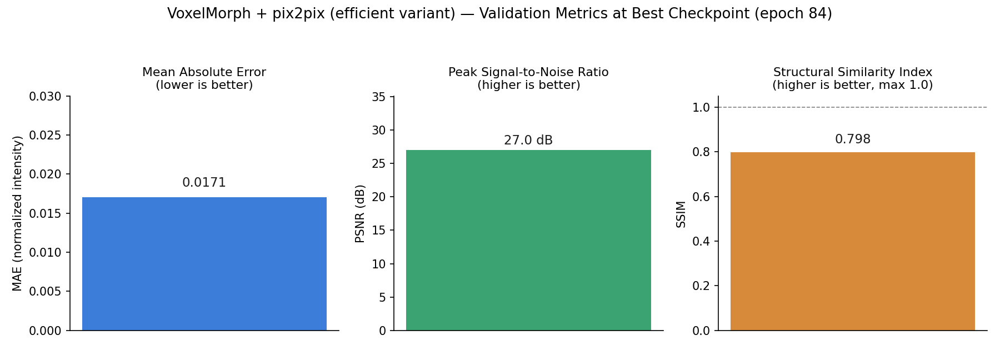

# VoxelMorph + pix2pix (Efficient Variant): MRI-to-sCT Synthesis

A lightweight redesign of the same VoxelMorph + pix2pix architecture used in
[`voxelmorph_pix2pix_sct`](../voxelmorph_pix2pix_sct/), built to test how much
of the full model's image-translation quality survives a large reduction in
network capacity — relevant when the target deployment is constrained hardware
rather than a research GPU cluster.

## Architecture

Same three-network design as the full variant — VoxelMorph registration
network, pix2pix generator, PatchGAN discriminator, trained jointly — but with
substantially fewer channels and layers per sub-network:

| Sub-network | Full variant | Efficient variant |
|---|---|---|
| VoxelMorph | 46 weight tensors | 14 weight tensors |
| Generator | 31 weight tensors | 24 weight tensors |
| Discriminator | 10 weight tensors | 8 weight tensors |

## Checkpoint metadata (best model)

| Field | Value |
|---|---|
| Best epoch | 84 |
| Validation MAE | 0.0171 |
| Validation PSNR | 27.0 dB |
| Validation SSIM | 0.798 |
| Checkpoint size | ~68 MB |

Values were read directly from the saved checkpoint's `val_metrics` dictionary
(`mae`, `psnr`, `ssim`) via `torch.load`, not re-derived or hand-typed.

## Validation metrics

## Efficient vs. full-capacity variant

| | `voxelmorph_pix2pix_efficient` | `voxelmorph_pix2pix_sct` |
|---|---|---|
| Checkpoint size | ~68 MB | ~515 MB |
| Size ratio | 1x | **7.3x larger** |
| Best epoch | 84 | 59 |
| Validation MAE | **0.0171** | 0.0374 |

On the metric both checkpoints report — validation MAE — the smaller model
scores lower error, at roughly 1/7th the parameter footprint. This is not a
strictly like-for-like comparison: the two runs differ in more than model size
(different epoch counts, and the full variant's checkpoint predates the
addition of PSNR/SSIM to the validation loop, so those two metrics only exist
for the efficient run). Read as a size/footprint result rather than a clean
ablation — but a compact model landing at a similar or better error than its
much larger counterpart is a real finding worth flagging, not one to explain
away.

## What is not in this repository

Model weights (~68 MB) are not included in this portfolio repository.
**Weights are available on request.**
