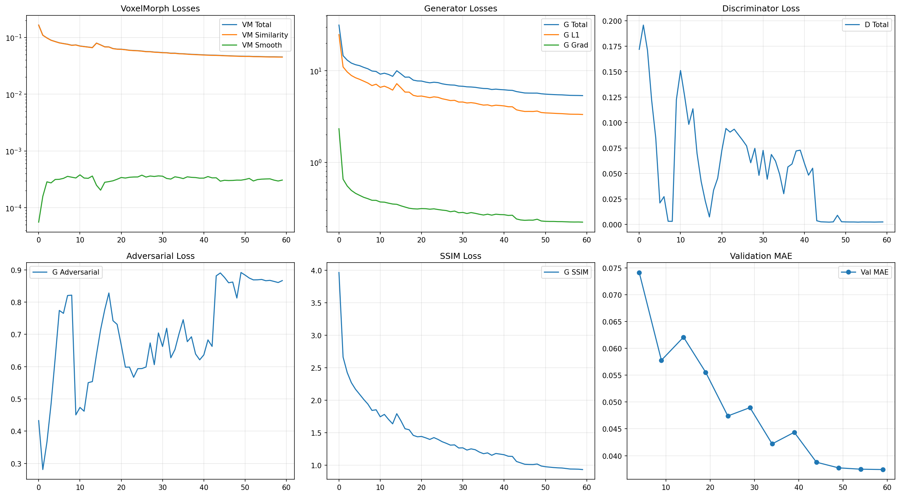

# VoxelMorph + pix2pix: MRI-to-sCT Synthesis

Deep-learning pipeline that turns an MRI volume into a synthetic CT (sCT) by
composing a deformable registration network with a conditional image-translation
network. Synthetic CT from MRI removes the need for a separate CT acquisition in
MRI-only radiotherapy planning workflows, where CT is normally required to
compute dose from electron density.

## Architecture

Two networks are trained jointly and checkpointed together:

- **VoxelMorph** — a U-Net-style deformable registration network that predicts a
  dense displacement field to spatially align the MRI and CT volumes before
  translation, correcting for patient motion and residual misregistration
  between the two modalities.
- **Generator (pix2pix)** — a conditional U-Net generator that maps the
  registered MRI to a synthetic CT, trained with a combined L1 + image-gradient
  loss against the real CT.
- **Discriminator (PatchGAN)** — a convolutional discriminator that scores
  patches of the generated CT as real or fake, providing the adversarial signal
  that pushes the generator toward sharper, more CT-realistic texture than an
  L1-only objective would produce on its own.

The checkpoint stores all three sub-networks' weights under separate keys
(`voxelmorph`, `generator`, `discriminator`), plus the training epoch and the
held-out validation MAE at that epoch — read directly from the saved file
rather than transcribed from a log.

## Checkpoint metadata (best model)

| Field | Value |
|---|---|
| Best epoch | 59 |
| Validation MAE | 0.0374 |
| VoxelMorph parameters | 46 weight tensors (encoder-decoder + displacement head) |
| Generator parameters | 31 weight tensors (encoder-decoder U-Net) |
| Discriminator parameters | 10 weight tensors (PatchGAN) |
| Checkpoint size | ~515 MB |

## Training curves

Six panels tracked across 60 epochs: VoxelMorph registration loss (similarity +
smoothness regularizer), generator loss (total, L1, and image-gradient terms),
discriminator loss, the generator's adversarial term, an SSIM-based loss term,
and validation MAE. Validation MAE drops from ~0.074 at the first checkpoint to
its minimum of 0.0374 by epoch 59, plateauing over the final ~15 epochs — the
signal used to select the best checkpoint. The discriminator loss collapsing
toward zero in the last third of training is a known pix2pix dynamic (the
discriminator overpowering the generator) and is disclosed here rather than
cropped out of the figure.

## What is not in this repository

Model weights (~515 MB) are not included in this portfolio repository.
**Weights are available on request.** The metadata and figures above were
extracted directly from the trained checkpoint (`torch.load` on the `.pth`
file) and are not hand-transcribed values.

## Related

A second, much smaller variant of this same architecture —
[`voxelmorph_pix2pix_efficient`](../voxelmorph_pix2pix_efficient/) — is 7.3x
smaller (68 MB vs. 515 MB) and in fact validates *better* on the metric both
checkpoints report (validation MAE 0.0171 vs. 0.0374 here). See that
project's README for a direct comparison and the caveats on comparability.
